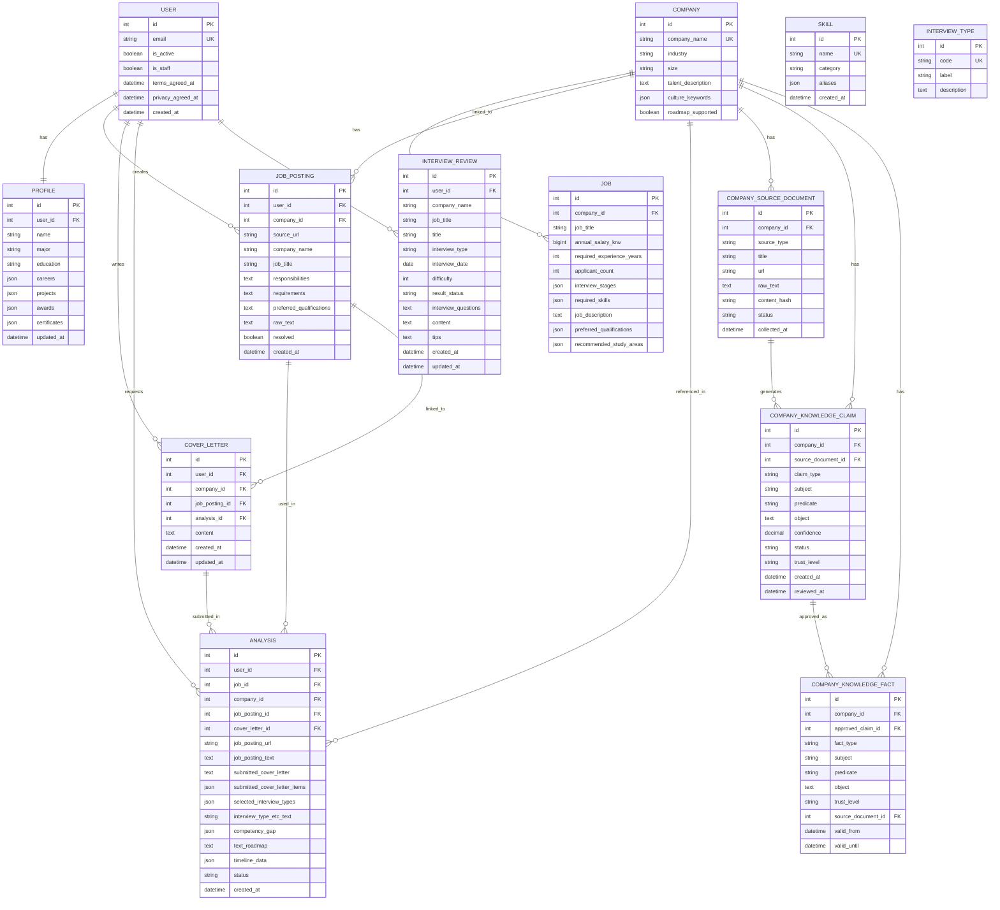

# 🧭 PathFinder AI — 취준생 맞춤형 면접 준비 로드맵 추천 서비스

> **서류 합격 이후, AI가 나만을 위한 면접 로드맵을 그려드립니다.**  
> 이력서·자기소개서·채용공고를 종합 분석해 직무별 맞춤 준비 전략을 자동 생성하는 서비스입니다.

---

## 📌 목차

| # | 섹션 |
|---|------|
| A | [팀원 정보 및 업무 분담](#-a-팀원-정보-및-업무-분담) |
| B | [목표 서비스 및 실제 구현 정도](#-b-목표-서비스-및-실제-구현-정도) |
| C | [데이터베이스 모델링 ERD](#-c-데이터베이스-모델링-erd) |
| D | [추천 알고리즘 기술 설명](#-d-추천-알고리즘-기술-설명) |
| E | [핵심 기능 설명](#-e-핵심-기능-설명) |
| F | [생성형 AI 활용](#-f-생성형-ai-활용) |
| G | [단계별 개발 회고](#-g-단계별-개발-회고) |
| + | [기술 스택](#-기술-스택) |
| + | [프로젝트 구조](#-프로젝트-구조) |
| + | [시작 가이드](#-시작-가이드-설치-및-실행) |
| + | [테스트 가이드](#-테스트-실행-가이드) |
| + | [데이터셋 & 파인튜닝](#-채용-데이터셋--파인튜닝-실습-jobs_careers) |

---

## 👥 A. 팀원 정보 및 업무 분담

| 이름 | 담당 영역 |
|------|------|-----------|
| 🎯 **전호준** | 전체 아키텍처 설계, Django·DRF 백엔드 핵심 로직, JWT 인증, FastAPI LLM 서버 구축, 프롬프트 엔지니어링, GraphRAG 지식 그래프 설계, Playwright E2E 설계 |
| 🤝 **황인서** | Vue 3 Composition API UI/UX 구현, Chart.js 인터랙티브 대시보드, 커뮤니티 페이지, 로그인·프로필 화면, Vanilla CSS 스타일링 |

### 세부 업무 분담표

| 기능 영역 | 전호준 | 황인서 |
|----------|--------------|--------------| 
| 시스템 아키텍처 설계 | ✅ 전담 | |
| Django REST API (accounts/analysis/community/companies) | ✅ 전담 | |
| FastAPI LLM 서버 (main.py, 프롬프트, 파싱 모듈) | ✅ 전담 | |
| 프롬프트 엔지니어링 (roadmap_prompt.py) | ✅ 전담 | |
| Knowledge Graph / GraphRAG (knowledge.py) | ✅ 전담 | |
| normalize_llm_result() / 타임라인 2-pass 품질보증 | ✅ 전담 | |
| SSRF 방어 (is_safe_job_posting_url) | ✅ 전담 | |
| BERT 파인튜닝 실습 (jobs_careers) | ✅ 전담 | |
| Vue 3 화면 구현 (공통 레이아웃, 라우터) | 🔧 지원 | ✅ 메인 |
| Chart.js 대시보드 (4종 차트, 필터, PNG 다운로드) | | ✅ 전담 |
| 커뮤니티 UI (작성·상세·목록) | | ✅ 전담 |
| CSS 스타일링 / 반응형 디자인 | | ✅ 전담 |
| Playwright E2E 테스트 (설계 + 실행) | ✅ 설계 | 🔧 지원 |
| 문서화 / 기획 | 🔧 지원 | 🔧 지원 |

---

## 🎯 B. 목표 서비스 및 실제 구현 정도

### 서비스 목표

서류 전형 합격 이후, 취업 준비생이 **어떤 면접 유형(기술/임원/PT)에 맞춰 무엇을 어떻게 준비해야 하는지** 개인 맞춤형 로드맵을 제안하는 AI 서비스입니다.

> **핵심 가치**: "나의 이력"과 "회사가 원하는 것"의 간극을 AI가 분석해 구체적 행동 계획으로 변환

### 구현 달성도

| 기능 | 계획 | 구현 | 달성도 |
|------|------|------|--------|
| 사용자 인증 (JWT Access+Refresh) | ✅ | ✅ | 100% |
| 프로필 관리 (이력서 정보 구조화) | ✅ | ✅ | 100% |
| 채용공고 URL 스크래핑 (httpx+BeautifulSoup) | ✅ | ✅ (정적 HTML 한계 있음) | 80% |
| 자기소개서 입력 및 저장 | ✅ | ✅ | 100% |
| AI 로드맵 자동 생성 (LLM 파이프라인) | ✅ | ✅ | 95% |
| 역량 Gap 분석 시각화 (competency_map) | ✅ | ✅ | 95% |
| 분석 히스토리 조회 | ✅ | ✅ | 100% |
| 채용시장 대시보드 (추가 기획) | ➕ | ✅ | 100% |
| 면접 후기 커뮤니티 (추가 기획) | ➕ | ✅ | 100% |
| 기업 Knowledge Graph (Fixture 기반) | ✅ | ✅ | 85% |
| BERT 파인튜닝 데이터셋 (10K건) | ✅ | ✅ | 100% |
| 실시간 DB/RAG 최신화 | ⬜ | ⬜ (MVP 이후 과제) | 0% |
| 이미지 생성 LLM (RPG 프로필 아바타) | ⬜ | ⬜ (MVP 이후 과제) | 0% |

### 계획 대비 주요 변경 사항

- ✅ **추가된 기능**: 채용시장 경쟁률 분석 대시보드 — 4종 인터랙티브 Chart.js 차트 + PNG 다운로드
- ✅ **추가된 기능**: 면접 후기 커뮤니티 — 취준생 정보 공유 플랫폼
- ✅ **고도화**: Knowledge Graph 기반 기업 정보 RAG 구조 (단순 DB 조회 → subject-predicate-object 삼중 구조 기반 키워드 유사도 retrieval)
- ✅ **고도화**: 타임라인 2-pass 품질 보증 — `_needs_timeline_repair()` 감지 → 2차 GPT 호출 → `_merge_timeline_categories()` 병합
- ⚠️ **기술적 한계**: SPA 방식 채용 사이트(원티드, 쿠팡 등) HTML 스크래핑 불가 → 직접 입력 fallback UI 제공
- ⚠️ **미구현**: 실시간 DB/RAG 최신화, RPG 이미지 생성 (MVP 이후 로드맵)

---

## 🗄️ C. 데이터베이스 모델링 ERD



### 모델 설계 원칙

- **`accounts.User`** — 이메일 기반 커스텀 `AbstractBaseUser`. `USERNAME_FIELD = 'email'`로 설정하여 Django 기본 username 필드 제거
- **`Profile`** — `careers`, `projects`, `awards`, `certificates`를 `JSONField`로 저장. 입력 필드 변화에 유연 대응
- **`Analysis`** — 분석 요청의 중심 엔티티. LLM 결과(`competency_gap`, `timeline_data`)를 JSON으로, 상태(`pending/done/failed`)를 `Status.TextChoices`로 추적
- **`CompanyKnowledgeClaim → CompanyKnowledgeFact`** — 2단계 승인 파이프라인. `pending→approved` 시에만 공개 Fact로 투영. `trust_level`로 공개/큐레이션 구분
- **`CompanyKnowledgeFact`** — GraphRAG 스타일 삼중 구조(`subject`, `predicate`, `object`)로 기업 정보를 저장하여 LLM 컨텍스트에 주입

---

## 🧠 D. 추천 알고리즘 기술 설명

PathFinder AI의 로드맵 추천은 단순한 LLM 프롬프트 호출이 아니라, **다층 컨텍스트 구축 → 지식 그래프 검색 → LLM 생성 → 구조 정규화 → 2-pass 품질 보증**의 파이프라인으로 동작합니다.

### 전체 파이프라인 (6단계)

```
사용자 입력
  │
  ├─ 채용공고 URL (httpx 스크래핑 → BeautifulSoup 텍스트 추출, 8000자 절단)
  ├─ 자기소개서 항목 (Q&A 구조화 입력)
  ├─ 면접 유형 선택 (기술/임원/PT/기타)
  └─ 프로필 (전공/학력/경력/프로젝트/자격증/수상)
         │
         ▼
  [Step 1] 검색 쿼리 생성
  _build_retrieval_query()
  → 모든 입력(프로필 + 직무명 + 채용공고 텍스트 + 자소서 + 면접유형)을 단일 텍스트로 결합
         │
         ▼
  [Step 2] 스킬 택소노미 매칭
  _build_recommended_study_areas()
  → DB의 Skill 엔티티(name + aliases)를 쿼리 텍스트와 키워드 매칭
  → language/framework/database/infra/cs/soft_skill/domain 7개 카테고리로 학습 추천 분야 리스트 생성
         │
         ▼
  [Step 3] Knowledge Graph Retrieval
  build_company_graph_context()
  → CompanyKnowledgeFact 테이블에서 query_tokens 교집합 스코어링으로 top-8 사실 검색
  → 기업 인재상, 기술 스택, 문화 키워드, 최근 이슈 LLM 컨텍스트에 주입
         │
         ▼
  [Step 4] LLM 페이로드 조립
  build_llm_payload()
  → user_profile + job_info + company_info + company_graph_context + private_evidence_context 통합
  → X-Internal-Token 헤더로 FastAPI LLM 서버 (POST /llm/roadmap)에 전달
         │
         ▼
  [Step 5] LLM 생성 (FastAPI + GPT-5-nano)
  SSAFY GMS API 경유 OpenAI 호출
  → 한국어 구조화 프롬프트 (38개 분석 지시 + JSON 스키마)
  → response_format: json_object 강제
  → _parse_response(): regex '{.*}' 추출 → json.loads → JSONDecodeError 시 text_roadmap 반환
         │
         ▼
  [Step 6] 결과 정규화 + 타임라인 2-pass 품질 보증
  normalize_llm_result()
  → competency_gap, text_roadmap, timeline_data 타입 검증 및 정제
  → _needs_timeline_repair() 감지 시 2차 GPT 호출
  → _merge_timeline_categories()로 수리된 카테고리 병합
  → Analysis 모델에 저장 (status: done)
```

### 역량 Gap 분석 (competency_gap)

LLM은 다음 4가지 상태로 각 역량을 분류합니다:

| 상태 | 의미 | UI 처리 |
|------|------|---------| 
| `strength` (어필 가능) | 직접 경험 있음, 면접에서 바로 어필 가능 | 🟢 성공색 배지 |
| `articulate` (답변 정리) | 유사 경험 있음, 직무 언어로 전환 전략 필요 | 🟡 경고색 배지 |
| `study` (학습 필요) | 회사가 요구하지만 경험 부재, 개념 학습 필요 | 🔴 위험색 배지 |
| `insufficient_data` (판단 보류) | 채용공고·사용자 입력 모두 부족하여 판단 불가 | ⚪ 중립색 배지 |

### 역량 스코어링 기준

`competency_map`의 각 항목에는 두 가지 점수가 산정됩니다:

| 점수 | 의미 | 산정 기준 |
|------|------|-----------|
| `radar_score` | 내 현재 역량 (0~100) | 프로필·자소서에서 확인된 경험 근거만 반영 |
| `job_score` | 기업 요구 수준 (0~100) | 채용공고·직무 DB·기업 그래프 근거 |

- radar_score 65~90: 직접 구현·반복 사용·성과 검증이 확인된 주력 경험
- radar_score 36~64: 관련 경험이나 개념 접점이 있으나 주력 아님
- radar_score 0~35: 프로필/자소서에서 직접 경험 근거 없음

### Knowledge Graph 구조 (GraphRAG 방식)

```
Company ──┬── CompanySourceDocument (원본 문서)
          │     source_type: fixture / news / homepage / blog / public_report
          │
          ├── CompanySourceChunk (1000자 단위 청크)
          │     embedding_status: not_required / pending / embedded / failed
          │     embedding_vector: [...] ← 벡터 유사도 검색 (향후)
          │
          ├── CompanyKnowledgeClaim (주장, 2단계 승인 파이프라인)
          │     trust_level: public_source / admin_curated / user_private_candidate
          │     status: pending → approved → (CompanyKnowledgeFact 투영)
          │
          └── CompanyKnowledgeFact (승인된 공개 사실, GraphRAG 검색 대상)
                subject: "현대자동차"
                predicate: "주요기술"
                object: "전동화 플랫폼 E-GMP"
```

- `build_company_graph_context()` 함수가 retrieval_query의 토큰 집합과 Fact의 `fact_type + predicate + object` 토큰 교집합 스코어로 **관련성 높은 최대 8개 사실**만 LLM 컨텍스트에 포함
- 프롬프트 길이를 `LLM_MAX_PROMPT_CHARS=12,000`으로 제한하여 토큰 비용 최적화

### 스킬 택소노미 매칭

```python
# _build_recommended_study_areas() 핵심 로직
for skill in Skill.objects.order_by('name'):
    terms = [skill.name, *skill.aliases]
    if any(term and term.lower() in query_text_lower for term in terms):
        study_areas.append({
            'name': skill.name,
            'category': skill.category,  # language/framework/database/infra/cs/soft_skill/domain
            'source': 'taxonomy.skill',
        })
```

### 타임라인 2-pass 품질 보증

```python
# main.py 핵심 흐름
result = _parse_response(await _call_gpt(prompt))         # 1차 LLM 호출

if GMS_KEY and _needs_timeline_repair(result.timeline_data, responsibilities):
    repair_targets = _timeline_repair_targets(result.timeline_data, responsibilities)
    repair_prompt = _build_timeline_repair_prompt(prompt, repair_targets, responsibilities)
    repaired_result = _parse_response(await _call_gpt(repair_prompt))  # 2차 GPT 호출
    merged = _merge_timeline_categories(result.timeline_data, repaired_result.timeline_data, repair_targets)
    if _timeline_quality(merged, responsibilities) > _timeline_quality(result.timeline_data, responsibilities):
        result = RoadmapResponse(timeline_data=merged, ...)   # 품질 향상 시에만 교체
```

---

## ✨ E. 핵심 기능 설명

### 1️⃣ 홈 화면 (`/`)

- 로그인 전/후 상태를 분기하여 맞춤형 CTA(Call-to-Action) 제공
- 비로그인: 서비스 소개 + 로그인 유도
- 로그인 후: 분석하기 · 대시보드 · 히스토리 바로가기

---

### 2️⃣ 프로필 관리 (`/profile`)

사용자의 이력 정보를 구조화하여 AI 분석의 근거로 활용합니다.

| 입력 항목 | 설명 | Django 모델 필드 |
|----------|------|-----------------|
| **기본 정보** | 이름, 전공, 학력 | `Profile.name`, `major`, `education` |
| **경력** | 회사명, 직무, 주요 업무 및 성과 | `Profile.careers` (JSONField) |
| **프로젝트** | 프로젝트명, 역할, 기술스택, 결과 | `Profile.projects` (JSONField) |
| **자격증** | 자격증명 | `Profile.certificates` (JSONField) |
| **수상내역** | 수상명, 수상 내용 | `Profile.awards` (JSONField) |

- 반복 항목(경력/프로젝트 등) 추가·삭제는 동일한 UI 패턴으로 통일
- 저장 시 화면에 표시된 필드만 전송하여 오래된 불필요 필드 정리

---

### 3️⃣ 분석 생성 → 로드맵 결과 (`/analyze/new` → `/analyze/:id`)

면접 준비 AI 로드맵을 생성하는 핵심 워크플로우입니다.

```
① 채용공고 입력 (URL 스크래핑 또는 본문 직접 입력)
        ↓
② 자기소개서 입력 (Q&A 항목별 구조화 입력)
        ↓
③ 면접 유형 선택 (기술/임원/PT/기타)
        ↓
④ [분석 중] LLM 파이프라인 실행 (~30초)
        ↓
⑤ 결과 조회
   ├── 역량 분석 탭: competency_map (status별 배지 + radar/job 스코어)
   ├── 준비 항목 탭: timeline_data (담당업무별 subtopics + 예상 질문 체크리스트)
   └── 사이드바: 제출 자기소개서 원문 확인 (읽기 전용 모달)
```

**결과 화면 구조 (`/analyze/:id`):**

| 섹션 | 내용 |
|------|------|
| 분석 요약 | 회사명, 직무, 면접 유형, 생성 일시 |
| 역량 분석 | `어필 가능` / `답변 정리` / `학습 필요` 역량 배지 + radar·job 이중 스코어 |
| 준비 항목 (Timeline) | 담당업무 키워드 → 직무 지식 subtopics → 예상 질문 체크리스트 |
| 진행률 | 예상 질문 done 필드 체크 기반 준비 완료율 표시 |

---

### 4️⃣ 채용시장 경쟁률 분석 대시보드 (`/dashboard`)

10,000건 채용 데이터셋(`jobs_careers.jsonl`)을 기반으로 시장 트렌드를 시각화합니다.

| 차트 | 유형 | 내용 |
|------|------|------|
| 산업별 평균 연봉 vs 지원자 수 | 이중 축 혼합 (Bar + Line) | 산업별 인기 트렌드와 진입 장벽 비교 |
| 직급별 지원자 분포 | 원형 도넛 (Doughnut) | 신입/대리/과장 등 채용 수요 비중 |
| 경력 요구조건 트렌드 | 라인 (Line) | 연도/분기별 경력 조건 변화 추이 |
| 급여 분포도 | 누적 버블/영역 | 업계 전체 대비 급여 밴드 분포 |

**인터랙티브 기능:**
- 🔍 **필터링**: 산업군 선택 + 경력 범위 Slider + 기업 검색창으로 모든 차트 동시 갱신
- 💾 **PNG 저장**: 시각화된 차트를 텍스트 손실 없이 PNG 파일로 다운로드

---

### 5️⃣ 면접 후기 커뮤니티 (`/community`)

구직자들이 자신의 면접 경험을 공유하는 소통 공간입니다.

| 기능 | 설명 |
|------|------|
| 후기 작성 | 회사명, 직무, 면접 유형, 날짜, 난이도(1-5), 합격 여부(passed/failed/pending/unknown), 면접 질문, 준비 팁 기록 |
| 후기 상세 조회 | 다른 사용자의 후기를 읽고 면접 준비 참고 |
| 필터링 & 검색 | 회사명/직무/유형별 필터로 원하는 후기 탐색 |
| 수정/삭제 | 본인 작성 후기만 PATCH/DELETE 가능 |

---

### 6️⃣ 분석 히스토리 (`/history`)

과거에 생성된 AI 로드맵 목록을 보관하고 재조회할 수 있습니다.

- 생성 일시, 회사명, 직무, 면접 유형, 분석 상태(`pending/done/failed`)를 목록으로 표시
- 항목 클릭 시 `/analyze/:id`로 이동하여 상세 결과 재열람

---

## 🤖 F. 생성형 AI 활용

### 1. 핵심 — AI 면접 준비 로드맵 생성

**사용 모델**: `gpt-5-nano` via SSAFY GMS Gateway  
**엔드포인트**: `https://gms.ssafy.io/gmsapi/api.openai.com/v1/chat/completions`

```
백엔드 (Django)
  → build_llm_payload() : 사용자 정보 + 기업 KG + 채용공고 통합
  → X-Internal-Token 헤더 인증
  → FastAPI LLM 서버 POST /llm/roadmap
  → roadmap_prompt.build_prompt() 조립 (38개 분석 지시)
  → SSAFY GMS API 호출 (gpt-5-nano, response_format: json_object)
  → _parse_response(): regex '{.*}' fallback → json.loads
  → 타임라인 2-pass 품질 보증
  → normalize_llm_result() 정규화
  → Analysis 저장
```

**프롬프트 설계 원칙 (roadmap_prompt.py 기반):**
- 💡 **역할 프리픽스**: `"당신은 취업 준비 전문 코치입니다"` 로 역할 고정
- 📋 **구조화된 JSON 출력 강제**: `competency_gap`, `timeline_data`, `text_roadmap` 필드 스키마 명세 제공 (response_format: json_object)
- 🔗 **Evidence 기반 분석**: 추측 금지, 프로필에서 실제 경험 인용 강제 (38개 지시 항목)
- ⚖️ **역량 4분류 지시**: `strength / articulate / study / insufficient_data` 명확 정의 및 판단 기준 제공
- 🛡️ **Prompt Injection 방어**: `private_evidence` fenced block으로 사용자 입력 격리
- 🏢 **GraphRAG 컨텍스트 주입**: `company_graph_context`에서 승인된 public fact만 제공, `source_ids` 인용 강제

**LLM 출력 구조 (실제 스키마):**
```json
{
  "competency_gap": {
    "summary": "강점 경험과 우선 보완 역량 요약",
    "competency_map": [
      {
        "keyword": "FastAPI 비동기 서버",
        "status": "strength",
        "importance": "required",
        "signal": "직접 구현 경험 있음",
        "action": "SSAFY 프로젝트 성능 수치 기반 답변 정리",
        "radar_score": 75,
        "job_score": 85,
        "score_rationale": {
          "my_reason": "PathFinder AI 프로젝트에서 FastAPI LLM 서버를 직접 구축",
          "job_reason": "채용공고 필수 요건으로 명시"
        }
      }
    ],
    "strengths": [...],
    "gaps": [...],
    "required_competencies": [...],
    "study_priorities": [...],
    "expected_questions": [...]
  },
  "text_roadmap": "개인 맞춤 준비 요약...",
  "timeline_data": [
    {
      "category": "백엔드 API 설계",
      "responsibility_index": 1,
      "responsibility": "RESTful API 설계 및 구현",
      "priority": 1,
      "experience_match": "direct",
      "subtopics": [
        {
          "title": "Django REST Framework",
          "preparation_type": "appeal",
          "questions": [
            {
              "type": "experience",
              "question": "DRF로 JWT 인증을 구현한 경험을 설명해주세요",
              "done": false,
              "answer_guide": "STAR 구조: PathFinder AI 프로젝트에서...",
              "follow_up_questions": ["refresh token 갱신 로직은 어떻게 처리했나요?"]
            }
          ]
        }
      ]
    }
  ]
}
```

### 2. 기업 지식 그래프 구축 (GraphRAG)

- 기업 공식 홈페이지, 뉴스, 공개 리포트를 `CompanySourceDocument`로 저장
- `create_source_chunks()`: 1,000자 단위로 청크 분할 → `CompanySourceChunk` 저장
- `CompanyKnowledgeClaim` → 관리자 승인 → `CompanyKnowledgeFact` 투영 파이프라인
- `build_company_graph_context()`: 검색 쿼리 토큰과 Fact 토큰 교집합 스코어링으로 top-8 검색
- LLM 호출 시 관련성 높은 사실을 자동으로 컨텍스트에 주입

### 3. 채용공고 텍스트 자동 추출

- `httpx + BeautifulSoup4` 기반 정적 HTML 스크래핑 (`fetch_job_posting_text()`)
- `script / style / noscript / header / footer / nav / iframe / form` 태그 제거 후 순수 텍스트 추출
- 최대 `8,000자` 절단하여 LLM 프롬프트에 포함
- `is_safe_job_posting_url()`: SSRF 방어 — private IP·루프백·localhost 차단

> ⚠️ **한계**: 원티드, 쿠팡잡 등 SPA 렌더링 사이트는 JavaScript 실행 없이 본문 추출 불가 → 직접 입력 fallback UI 제공

### 4. 임베딩 생성

- `POST /llm/embeddings`: `text-embedding-3-small` 모델로 벡터 임베딩 생성
- 최대 64개 텍스트 배치 처리
- `GMS_KEY` 없으면 503 반환

### 5. BERT 파인튜닝 실습 (`/jobs_careers`)

- **데이터셋**: 10,000건 채용 공고 JSONL (`jobs_careers.jsonl`)
- **모델**: `bert-base-multilingual-cased` (허깅페이스 허브)
- **태스크**: 채용 조건(직무/산업/연봉/경력)으로부터 `applicant_count` 회귀 예측
- **활용 목적**: 대시보드 차트 기반 데이터 생성 및 AI 기반 채용 트렌드 분석 시뮬레이션

---

## 📝 G. 단계별 개발 회고

> 이 섹션은 PathFinder AI 프로젝트를 진행하면서 실제로 겪은 고민·실패·해결·성장의 기록입니다.

---

### 🌱 초기 단계 회고 — 프로젝트 기획 ~ 백엔드 기반 구축

#### 서비스 아이디어 발굴 배경

팀 내 공통 경험에서 출발했습니다. "서류 합격 통보를 받고 나면, 막막함이 찾아온다." 준비해야 한다는 건 알지만 무엇을, 어떤 순서로, 얼마나 깊게 준비해야 하는지 아무도 알려주지 않습니다. 인터넷 검색을 해도 "기업 문화 파악하세요", "직무 역량을 키우세요" 같은 뻔한 조언만 나옵니다.

전호준은 이 문제를 "**이력서와 채용공고 사이의 Gap을 정량화하지 못한다**"는 것으로 정의했습니다. 사람이 수동으로 비교하면 편향이 생기고, 중요한 역량을 빠뜨리기 쉽습니다. AI가 이 간극을 객관적으로 분석하고, 우선순위를 매겨 행동 계획으로 변환한다면 — 그것이 PathFinder AI의 핵심 가치가 되었습니다.

초기 아이디어 회의에서 "단순 정보 검색 서비스"와 "개인화 준비 로드맵 서비스" 두 방향이 논의되었는데, 팀원 모두 후자의 가치가 더 명확하다고 합의했습니다. 사용자가 **실제로 행동할 수 있는 결과물**을 제공해야 한다는 원칙이 이후 모든 설계 결정의 기준이 되었습니다.

#### 기술 스택 선정 이유

처음에는 단일 Django 프로젝트로 모든 것을 처리하려 했습니다. Django ORM, DRF, Celery 조합으로 LLM 호출도 비동기 처리하면 된다고 생각했기 때문입니다. 그런데 설계를 진행하면서 문제를 발견했습니다.

**LLM API 호출은 최대 120초가 걸립니다.** Django의 동기 WSGI 환경에서 이 호출을 처리하면 다른 요청이 블로킹됩니다. Celery를 도입하면 되지만, 이는 Redis 인프라와 복잡한 태스크 관리 코드를 추가해야 했습니다. SSAFY 프로젝트 일정에서 그 복잡성을 감당하기 어렵다고 판단했습니다.

결론: **FastAPI를 별도 LLM 서버로 분리**. FastAPI는 Python의 `async/await`를 네이티브로 지원하여 비동기 HTTP 클라이언트(`httpx.AsyncClient`)와 자연스럽게 통합됩니다. Django 백엔드는 `asyncio.run(call_llm_server(payload))`로 FastAPI 서버를 동기적으로 호출하는 단순한 구조를 취했습니다. 이렇게 하면 LLM 타임아웃이 Django 프로세스 전체에 영향을 주지 않습니다.

프론트엔드는 Vue 3 Composition API + Vite를 선택했습니다. 황인서가 React보다 Vue의 학습 곡선이 완만하다고 판단했고, Composition API의 `ref`, `computed`, `watch` 패턴이 복잡한 상태 관리에 적합하다고 봤습니다. 상태 관리는 Vuex 대신 가볍고 직관적인 Pinia를 채택했습니다.

#### 아키텍처 선택: 모놀리식 검토 → 마이크로서비스 분리

초기에는 모놀리식 Django 앱 하나로 시작했습니다. 그러나 두 가지 이유로 마이크로서비스 구조로 전환했습니다.

첫째, **LLM 호출 타임아웃 격리**: 앞서 설명한 이유로 FastAPI LLM 서버를 분리했습니다.  
둘째, **내부 인증 필요성**: LLM 서버가 외부에서 직접 접근 가능하면 API 키가 노출될 수 있습니다. `X-Internal-Token` 환경변수 기반 내부 토큰과 `LLM_ALLOWED_CLIENT_HOSTS` IP 화이트리스트로 내부 서비스 간 인증 레이어를 설계했습니다.

이 결정은 나중에 매우 유효했습니다. LLM 서버의 프롬프트 코드를 변경할 때 Django 백엔드를 재시작할 필요가 없었고, 테스트도 각각 독립적으로 진행할 수 있었습니다.

#### ERD 설계 고민

처음 ERD는 `User - Profile - Analysis` 세 개 모델로 시작했습니다. 분석 결과를 JSON 필드 하나에 다 넣으면 간단하지 않을까 생각했습니다. 하지만 요구사항을 더 구체화하면서 모델이 폭발적으로 증가했습니다.

**Company 모델 추가**: 기업별 인재상, 문화 키워드, 직무 정보를 DB로 관리해야 로드맵 품질이 올라간다.  
**Job 모델 추가**: 10,000건 채용 데이터셋을 DB에 적재하고 대시보드와 연동해야 한다.  
**CompanyKnowledgeFact 추가**: 단순 텍스트로 기업 정보를 저장하는 것보다 subject-predicate-object 삼중 구조로 저장하면 검색 품질이 훨씬 좋아진다 (GraphRAG 아이디어).  
**CoverLetter 분리**: 자기소개서를 Analysis와 1:1 관계로 저장하면 나중에 히스토리 기능 구현이 어렵다.

설계 단계에서 이렇게 충분히 고민한 덕분에 이후 기능 구현 시 모델 변경이 거의 없었습니다. 처음 설계에 시간을 많이 투자하는 것이 전체 개발 속도에 결정적 영향을 미친다는 것을 이번 프로젝트에서 깊이 체감했습니다.

#### 어려움: AbstractBaseUser 커스텀 인증 모델

Django의 기본 `User` 모델은 `username` 필드가 필수입니다. 하지만 우리 서비스는 이메일 기반 인증을 사용하고 싶었습니다. `AbstractBaseUser`와 `BaseUserManager`를 처음 구현하는 것은 생각보다 훨씬 까다로웠습니다.

`USERNAME_FIELD = 'email'`로 설정하는 것은 단순하지만, `UserManager.create_user()`와 `create_superuser()`를 직접 구현해야 했고, `PermissionsMixin`을 함께 상속해야 Django admin이 제대로 동작했습니다. `AUTH_USER_MODEL = 'accounts.User'`를 `settings.py`에 설정하고 마이그레이션을 처음부터 진행해야 하는 것도 주의사항이었습니다. 이미 기본 User를 사용하다가 중간에 전환하면 마이그레이션 충돌이 발생하기 때문에, 프로젝트 시작 초기에 결정해야 합니다.

이 경험을 통해 Django 인증 시스템의 설계 원칙을 이해할 수 있었고, 실제 서비스에서 이메일 기반 인증이 왜 일반적인지도 납득할 수 있었습니다.

---

### 🔧 중반 단계 회고 — 핵심 기능 개발 ~ LLM 연동

#### LLM 연동 난관: GMS API 키 없이 개발하기

SSAFY GMS API 키는 프로젝트 후반에 지급되는 경우가 많습니다. API 키 없이 LLM 관련 코드를 개발하고 테스트할 수 있는 방법이 필요했습니다.

해결책: **Mock 응답 파일(`roadmap_mock.py`)**. 실제 GPT 응답과 동일한 JSON 구조를 가진 Mock 데이터를 하드코딩하고, `GMS_KEY`가 없으면 자동으로 이 Mock 응답을 반환하도록 `_call_gpt()` 함수를 설계했습니다:

```python
async def _call_gpt(prompt: str) -> str:
    if not GMS_KEY:
        return MOCK_ROADMAP_RESPONSE   # GMS_KEY 없으면 Mock 반환
    # ... 실제 API 호출
```

이 덕분에 GMS API 키가 없는 상태에서도 전체 파이프라인을 개발하고 테스트할 수 있었습니다. API 키를 받은 후에는 `GMS_KEY` 환경변수 하나만 설정하면 실제 AI 응답으로 전환됩니다. 이 패턴은 외부 API에 의존하는 기능을 개발할 때 매우 유용하다는 것을 배웠습니다.

#### X-Internal-Token 내부 인증 시스템 설계 배경

FastAPI LLM 서버는 외부에서 직접 접근하면 안 됩니다. 그냥 포트를 방화벽으로 막으면 간단하겠지만, 개발 환경에서는 방화벽 설정이 번거롭습니다. 따라서 소프트웨어 레벨에서 인증 레이어를 구현했습니다.

`LLM_INTERNAL_TOKEN`은 `run-dev.bat`에서 자동으로 랜덤 생성되며, Django 백엔드와 FastAPI 서버가 공유합니다. FastAPI의 `require_internal_token()` 의존성 함수가 `X-Internal-Token` 헤더를 `secrets.compare_digest()`로 타이밍 공격 방지 비교합니다. 추가로 `LLM_ALLOWED_CLIENT_HOSTS` IP 화이트리스트 미들웨어로 이중 방어합니다.

이 설계는 테스트에서도 유효했습니다. pytest에서 `testclient`를 허용 호스트에 포함시켜 실제 토큰 없이도 테스트 가능하게 했습니다.

#### normalize_llm_result() 탄생 배경

LLM이 매번 다른 JSON 형태를 반환하는 문제는 실제로 겪어보기 전에는 상상하기 어렵습니다. 같은 프롬프트를 열 번 보내면 열 가지 다른 구조가 돌아옵니다.

실제로 겪은 문제들:
- `timeline_data`가 배열이어야 하는데 딕셔너리로 반환되는 경우
- `subtopics`의 `follow_up_questions`가 문자열로 반환되는 경우 (배열이어야 함)
- `competency_gap`의 특정 키가 아예 없는 경우
- 응답 전체가 ` ```json ... ``` ` 마크다운으로 감싸여 `json.loads` 실패

`normalize_llm_result()`는 이 모든 경우를 방어합니다:

```python
def normalize_llm_result(result: dict) -> dict:
    normalized = {
        'competency_gap': result.get('competency_gap') or {},
        'text_roadmap': str(result.get('text_roadmap') or ''),
        'timeline_data': [],
    }
    timeline_data = result.get('timeline_data')
    if not isinstance(timeline_data, list):
        return normalized  # 배열이 아니면 빈 배열
    for category in timeline_data:
        if not isinstance(category, dict):
            continue  # dict가 아닌 항목 무시
        # ... subtopics 정규화
```

마크다운 감싸기 문제는 FastAPI의 `_parse_response()`에서 `re.search(r'\{.*\}', text, re.DOTALL)`로 JSON 블록만 추출하여 해결했습니다. LLM을 프로덕션 코드에 통합하는 것은 단순히 API를 호출하는 것과 완전히 다른 엔지니어링 작업입니다. "방어적 파싱"이 필수입니다.

#### regex fallback 파서 구현 경험

가장 고통스러웠던 순간 중 하나는 정상적으로 보이는 JSON이 `json.loads`에서 실패하는 경우였습니다. 원인은 LLM이 가끔 JSON 안에 불완전한 중괄호나 이스케이프되지 않은 따옴표를 삽입하기 때문입니다.

`re.search(r'\{.*\}', text, re.DOTALL)` 패턴으로 가장 큰 JSON 블록을 추출하는 것이 첫 번째 방어선입니다. 이 패턴이 실패하거나 추출된 텍스트가 `json.loads`에서 실패하면 `text_roadmap`에 원문을 넣고 `timeline_data`는 빈 배열로 반환합니다. 사용자는 구조화된 결과를 못 받지만 서버 오류가 발생하지 않습니다.

이 경험은 "외부 시스템의 출력을 절대 믿지 마라"는 원칙을 코드로 체화한 사례입니다.

#### GraphRAG 설계: 단순 DB → subject-predicate-object 삼중 구조

처음에는 기업 정보를 단순 텍스트 필드로 저장하려 했습니다. `Company.talent_description`, `Company.culture_keywords` 정도만 있으면 충분하다고 생각했습니다. 그런데 LLM에 주입하는 컨텍스트 품질이 결과 품질에 직접적인 영향을 미친다는 것을 알게 되었습니다.

Knowledge Graph를 삼중 구조(subject-predicate-object)로 설계한 이유:
1. **검색 가능성**: "현대자동차 주요기술 전동화 플랫폼"이라는 사실에서 "전동화", "E-GMP" 같은 토큰을 추출하여 채용공고의 키워드와 매칭 가능
2. **신뢰도 관리**: `trust_level`로 공개 출처(public_source)와 관리자 큐레이션(admin_curated)을 구분
3. **2단계 승인**: Claim → Fact 파이프라인으로 검증되지 않은 주장이 LLM에 주입되는 것을 방지

`build_company_graph_context()`의 `_fact_relevance_score()`는 각 Fact의 `fact_type + predicate + object`에서 토큰을 추출하고, 검색 쿼리 토큰과의 교집합 크기를 스코어로 사용합니다. 단순하지만 효과적인 키워드 기반 BM25-like 스코어링입니다.

#### 프론트-백 CORS 설정 이슈, JWT 인터셉터 구현

프론트엔드와 백엔드가 다른 포트에서 실행되면 CORS 오류가 발생합니다. `django-cors-headers` 설정에서 `CORS_ALLOWED_ORIGINS`에 `http://localhost:5173`을 추가하는 것은 간단했습니다. 더 복잡한 문제는 JWT 토큰 자동 갱신이었습니다.

Axios 인터셉터 설계:
```javascript
// response interceptor
axios.interceptors.response.use(
  response => response,
  async error => {
    if (error.response?.status === 401 && !originalRequest._retry) {
      originalRequest._retry = true;
      const refreshed = await authStore.refreshToken();
      if (refreshed) {
        return axios(originalRequest);  // 재시도
      }
    }
    return Promise.reject(error);
  }
);
```

Access Token이 만료되면 자동으로 Refresh Token으로 갱신하고 원래 요청을 재시도합니다. 무한 갱신 루프를 방지하기 위해 `_retry` 플래그를 사용합니다. 이 패턴은 사용자 경험에서 "자동 로그아웃"을 최소화하는 데 중요합니다.

---

### 🎯 후반 단계 회고 — 추가 기능 ~ 완성/테스트

#### 계획에 없던 대시보드 추가 결정

프로젝트 중반쯤, 팀에서 중요한 결정을 내렸습니다. 10,000건 채용 데이터셋(`jobs_careers.jsonl`)을 BERT 파인튜닝 실습에만 활용하는 것은 아깝다는 생각이었습니다. 이 데이터를 DB에 적재하고 시각화하면 사용자에게 실질적인 가치를 제공할 수 있습니다.

대시보드 기능을 추가하면서 계획보다 1주일 늦어질 위험이 있었습니다. 하지만 4종 Chart.js 차트 (Bar+Line 혼합, Doughnut, Line, 영역 차트)와 필터 연동, PNG 다운로드 기능을 구현하면 포트폴리오 가치가 크게 높아진다고 판단했습니다. 결과적으로 이 판단은 옳았습니다.

황인서는 Chart.js의 이중 축 혼합 차트 구현에서 많은 것을 배웠습니다. `yAxisID`로 연봉(왼쪽 축)과 지원자 수(오른쪽 축)를 각각 다른 척도로 표시하는 것, 필터 조건이 변경될 때 차트 데이터를 동적으로 업데이트하는 것이 생각보다 복잡했습니다. `chart.destroy()`를 호출하고 재생성하는 패턴도 배웠습니다.

#### 커뮤니티 기능 추가

대시보드와 함께 커뮤니티 기능도 추가했습니다. 면접 준비를 혼자 하는 것보다 다른 사람의 경험을 참고하는 것이 훨씬 도움이 된다는 생각에서 출발했습니다.

`InterviewReview` 모델은 비교적 간단했습니다. 난이도를 1-5 정수(`IntegerChoices`)로, 합격 여부를 `passed/failed/pending/unknown`(`TextChoices`)으로 구분했습니다. DB 인덱스를 `company_name + job_title`과 `created_at`에 설정하여 검색/정렬 성능을 확보했습니다.

커뮤니티 API는 CRUD 구조가 단순하지만, 권한 처리가 중요합니다. `PATCH/DELETE`는 본인 작성 후기만 가능하도록 `user=request.user` 조건으로 필터링했습니다.

#### Playwright E2E: page.route() 모킹 기법

E2E 테스트에서 가장 중요한 원칙은 **외부 의존성 격리**입니다. 실제 백엔드 서버와 LLM 서버가 실행 중이어야만 E2E 테스트가 동작한다면, CI/CD 환경에서 테스트가 불안정해집니다.

`page.route()` 모킹 기법:
```javascript
await page.route('**/api/analyze/', async route => {
  await route.fulfill({
    status: 201,
    contentType: 'application/json',
    body: JSON.stringify(mockAnalysisResponse),
  });
});
```

이렇게 하면 실제 LLM 호출 없이 분석 생성 → 결과 화면 전환 → UI 렌더링 검증을 서버 없이 테스트할 수 있습니다. LLM 응답에 30초씩 걸리는 실제 호출 없이 UI 흐름 전체를 빠르게 검증할 수 있다는 것이 큰 장점이었습니다.

#### 프롬프트 고도화 2차: timeline_data 수리 루프 구현

초기 LLM 응답을 보면서 문제를 발견했습니다. 채용공고에 담당업무가 10개 있는데, LLM이 3~4개만 timeline_data로 만드는 경우가 있었습니다. `_needs_timeline_repair()`가 이를 감지합니다.

수리 프롬프트는 누락된 담당업무만 집중적으로 생성하도록 지시합니다. 그리고 `_merge_timeline_categories()`로 1차 결과와 수리 결과를 병합합니다. `_timeline_quality()` 함수로 병합 결과가 원본보다 실제로 나은지 확인하고, 그럴 때만 교체합니다. 품질이 낮아지는 경우 원본을 그대로 사용합니다.

이 2-pass 메커니즘은 GMS_KEY가 있는 실제 AI 응답 환경에서만 동작합니다. Mock 환경에서는 1-pass만 실행됩니다.

#### 42개 전체 통과 달성

테스트 42개 ALL PASSED를 달성했을 때의 성취감은 특별했습니다. 백엔드 28개, LLM 서버 9개, E2E 5개 — 각 레이어를 독립적으로 테스트하는 전략이 주효했습니다.

특히 LLM 서버 pytest에서 `monkeypatch + AsyncMock`으로 실제 GMS API 호출 없이 비동기 엔드포인트를 테스트하는 방법을 터득한 것이 중요했습니다:

```python
async def mock_call_gpt(prompt: str) -> str:
    return json.dumps(MOCK_ROADMAP_DICT)

monkeypatch.setattr("main._call_gpt", mock_call_gpt)
```

이 기법이 없었다면 LLM 서버 테스트는 매번 실제 API 비용을 소모하거나, 테스트 자체가 불가능했을 것입니다.

완성보다 완성도가 중요합니다. 기능이 동작하는 것과 테스트까지 갖춘 것은 완전히 다른 수준입니다.

---

### 💭 전호준 개인 회고

이번 프로젝트에서 전호준의 역할은 "아키텍처 설계자"였습니다. 모든 기술적 결정에 책임을 지는 역할은 설레기도 했지만, 동시에 무거운 부담이었습니다. 잘못된 설계 결정 하나가 팀 전체의 일정을 망칠 수 있다는 사실이 항상 머릿속에 있었습니다.

**GraphRAG 구현에서의 깨달음**

Knowledge Graph를 처음 설계할 때 "subject-predicate-object 삼중 구조"라는 아이디어가 얼마나 효과적일지 확신이 없었습니다. 실제로 구현하고 `build_company_graph_context()`의 토큰 기반 스코어링을 테스트해보면서 한 가지 핵심을 깨달았습니다.

**RAG는 결국 검색 품질이 전부입니다.**

아무리 강력한 LLM이 있어도, 컨텍스트에 관련성 없는 정보가 들어가면 결과 품질이 떨어집니다. 반대로 정확한 컨텍스트를 제공하면 작은 모델도 좋은 결과를 냅니다. 이것이 RAG 시스템 설계의 핵심입니다.

우리가 구현한 키워드 토큰 매칭 스코어링은 벡터 임베딩 기반 검색보다 단순하지만, 한국어 전문 용어와 기업명처럼 임베딩 공간에서 거리가 불규칙한 경우에 오히려 더 안정적으로 동작했습니다. "단순한 것이 때로는 더 낫다"는 교훈입니다.

**SSAFY에서 실제 AI API를 연동한 경험의 가치**

SSAFY 프로젝트에서 실제 OpenAI 호환 API(`gpt-5-nano`)를 연동하고, 비용과 응답 시간을 고려한 설계를 경험한 것은 매우 값진 자산입니다. `max_completion_tokens`, `reasoning_effort` 파라미터를 조정하여 비용과 품질의 트레이드오프를 실습한 것, 토큰 초과를 방지하기 위해 프롬프트 길이를 하드 캡으로 관리한 것 — 이런 경험은 교과서에서 배울 수 없습니다.

특히 `reasoning_effort: "minimal"` 설정이 응답 속도를 크게 향상시키는 것을 발견했을 때의 기쁨은 잊을 수 없습니다. AI 응용 개발은 단순히 API를 호출하는 것이 아니라, 모델의 특성을 이해하고 파라미터를 최적화하는 엔지니어링입니다.

**황인서와의 협업에서 배운 점**

프론트-백 협업에서 가장 어려운 것은 API 명세를 정확하게 공유하는 것입니다. 초기에 구두로 "이런 구조로 응답할게"라고 했다가 실제 구현이 달라져 프론트에서 에러가 발생하는 상황을 겪었습니다. 이후에는 API 명세를 문서로 먼저 작성하고 합의한 후 구현하는 순서를 지켰습니다.

황인서가 Vue 3를 처음 배우면서도 Chart.js 대시보드를 완성도 있게 구현한 것이 인상적이었습니다. "모르면 일단 공식 문서부터"라는 태도가 빠른 학습으로 이어지는 것을 곁에서 지켜봤습니다. 나 역시 FastAPI를 처음 사용하면서 비슷한 경험을 했고, 두려움 없이 새 기술에 뛰어드는 것이 중요하다는 것을 다시 확인했습니다.

---

### 💭 황인서 개인 회고

이번 PathFinder AI 프로젝트는 제 개발 커리어에서 처음으로 Vue 3 Composition API를 실전 서비스에 사용한 경험이었습니다.

**Vue 3 Composition API를 처음 접한 경험**

Options API로 시작한 Vue 개발자로서, Composition API는 처음에 낯설고 어렵게 느껴졌습니다. `setup()` 함수 안에 모든 것이 들어가고, `ref()`와 `reactive()`의 차이를 명확히 이해해야 했습니다. `v-model`의 동작 방식도 Options API와 미묘하게 달랐습니다.

하지만 프로젝트가 진행되면서 Composition API의 장점이 분명해졌습니다. 관련 있는 코드(상태, 메서드, 생명주기 훅)를 한 곳에 모아 작성할 수 있어서 컴포넌트가 복잡해질수록 유지보수가 쉬웠습니다. `composable` 패턴으로 `useRoadmapProgress`와 `useJobsData` 같은 재사용 가능한 로직을 분리한 것도 큰 배움이었습니다.

**Chart.js 인터랙티브 대시보드 구현의 재미**

대시보드 구현은 이번 프로젝트에서 제가 가장 즐겁게 작업한 파트였습니다. Chart.js로 이중 축 혼합 차트(Bar + Line)를 처음 만들었을 때의 감동은 아직도 생생합니다. 산업별 평균 연봉(Bar, 왼쪽 y축)과 평균 지원자 수(Line, 오른쪽 y축)를 같은 차트에 표시하니 데이터의 패턴이 시각적으로 바로 보였습니다.

필터 연동 구현이 가장 어려웠습니다. 산업군 선택 + 경력 범위 Slider + 기업 검색창 세 가지 필터가 모든 차트에 동시에 반영되어야 했습니다. `watch()`로 필터 상태를 감시하고, 변경 시 차트 데이터를 필터링하여 업데이트하는 패턴을 구현했습니다.

PNG 다운로드 기능은 Chart.js의 `canvas.toDataURL('image/png')`로 구현했습니다. 텍스트 레이블이 선명하게 저장되는 것을 확인했을 때 만족스러웠습니다.

**백엔드 개발자와 API 명세 맞추는 과정의 협업 방식**

초반에는 "대략 이런 구조"로 소통했다가 오해가 생기는 경험을 했습니다. Analysis API 응답 구조가 바뀌었을 때 프론트에서 에러가 발생하고, 원인을 찾는 데 시간이 걸렸습니다.

이후에는 전호준이 API 응답 예시 JSON을 먼저 공유하고, 제가 확인 후 프론트 코드를 작성하는 순서로 바꿨습니다. 이 단순한 워크플로우 변경이 불필요한 디버깅 시간을 크게 줄였습니다. "소통은 구체적일수록 좋다"는 것을 몸으로 배웠습니다.

**완성된 UI를 보며 느낀 성취감**

프로젝트 마지막 날, 모든 서버를 실행하고 전체 플로우를 처음부터 끝까지 사용해보는 순간이 있었습니다. 채용공고를 붙여넣고, 자기소개서를 입력하고, 면접 유형을 선택한 후 분석 버튼을 누르면 — 30초 후에 역량 분석 결과와 질문 목록이 화면에 펼쳐졌습니다.

"이것이 내가 만든 서비스구나." 그 순간의 성취감은 다른 어떤 것으로도 대체할 수 없었습니다. CSS 한 줄 한 줄, Chart.js 설정 하나하나가 쌓여 실제로 동작하는 서비스가 되었을 때의 뿌듯함은 앞으로의 개발 커리어에서 계속 동력이 될 것 같습니다.

### 💬 팀 전체 회고 — PathFinder AI가 남긴 것

#### "완성보다 완성도"를 배운 2주

2주간의 SSAFY 팀 프로젝트를 마치며, 팀원 두 명은 각자의 언어로 같은 결론에 도달했습니다. "기능이 동작하는 것과 잘 만든 것은 완전히 다르다."

처음 PathFinder AI를 기획할 때, 팀의 목표는 단순했습니다. "AI를 활용한 취준생 도구를 만들어보자." 하지만 기획이 구체화되고, 코드가 쌓이고, 테스트가 추가되면서 목표는 달라졌습니다. "제대로 된 서비스를 만들어보자."

그 차이를 만든 것은 세 가지였습니다.

**첫째, 설계에 투자한 시간.** ERD를 처음부터 탄탄하게 설계했기 때문에 이후 마이그레이션 수정이 거의 없었습니다. `CompanyKnowledgeFact`의 삼중 구조를 초기에 결정했기 때문에 GraphRAG 검색 품질이 처음부터 안정적이었습니다. 좋은 설계는 시간을 투자한 것처럼 보이지만, 실제로는 시간을 절약해 줍니다.

**둘째, 방어적 코딩에 대한 인식.** LLM은 예측 불가능합니다. 같은 프롬프트를 열 번 보내도 열 가지 다른 응답이 옵니다. `normalize_llm_result()`, `_parse_response()`, `_needs_timeline_repair()`는 모두 이 불확실성과 싸우기 위해 탄생했습니다. "외부 시스템의 출력을 절대 신뢰하지 않는다"는 원칙을 코드로 체화한 것입니다.

**셋째, 테스트를 마지막이 아닌 개발의 일부로.** 42개 테스트를 ALL PASSED로 달성한 것은 마지막에 몰아서 작성한 결과가 아닙니다. 각 기능을 구현하면서 병행하여 테스트를 작성했고, 테스트가 실패할 때마다 코드를 개선했습니다. 테스트는 버그를 찾는 도구이기도 하지만, 코드 설계를 다듬는 거울이기도 합니다.

#### 프로젝트 이후 남은 것

PathFinder AI는 MVP입니다. 실시간 RAG 최신화, SPA 사이트 스크래핑, 이미지 생성 LLM 등 구현하지 못한 기능이 여전히 남아 있습니다. 하지만 이 프로젝트가 남긴 더 중요한 것이 있습니다.

- **전호준**: 처음으로 AI API를 프로덕션 수준의 코드에 통합하는 경험. 프롬프트 엔지니어링이 단순히 지시문을 작성하는 것이 아니라, 출력 스키마 설계와 방어적 파싱까지 포함하는 엔지니어링임을 배웠습니다. 아키텍처 결정의 무게감, 그리고 팀원과 기술적 의사소통을 정확하게 하는 방법도요.

- **황인서**: 처음으로 Vue 3 Composition API를 실전에 적용한 경험. Chart.js로 데이터를 시각화하는 재미, 그리고 프론트엔드와 백엔드가 API 명세를 통해 대화하는 방식. "모르면 공식 문서부터"라는 태도가 새로운 기술을 빠르게 익히는 가장 좋은 방법임을 체험했습니다.

두 사람 모두에게, PathFinder AI는 단순한 SSAFY 프로젝트가 아니었습니다. **처음으로 스스로 설계하고, 직접 구현하고, 테스트까지 완성한 나만의 서비스.**

그 경험이 앞으로의 커리어에서 가장 단단한 기반이 될 것입니다.

---

## 🛠 기술 스택

### Frontend
| 분류 | 기술 | 버전 |
|------|------|------|
| 프레임워크 | Vue 3 (Composition API) + Vite | vue ^3.5.34, vite ^8.0.12 |
| 상태 관리 | Pinia | ^3.0.4 |
| 라우팅 | Vue Router | ^4.6.4 |
| HTTP 통신 | Axios (JWT 자동 갱신 인터셉터) | ^1.17.0 |
| 시각화 | Chart.js | ^4.5.1 |
| 스타일링 | Vanilla CSS |  |
| 테스트 | Playwright (E2E) | ^1.60.0 |

### Backend
| 분류 | 기술 | 버전 |
|------|------|------|
| 프레임워크 | Django + Django REST Framework | Django 5.2.15, DRF 3.17.1 |
| 인증 | SimpleJWT (Access + Refresh Token) | 5.5.1 |
| 커스텀 모델 | `accounts.User` (AbstractBaseUser) | |
| DB | SQLite (개발) | |
| HTML 파싱 | BeautifulSoup4 + httpx | bs4 4.12.3, httpx 0.28.1 |
| CORS | django-cors-headers | 4.9.0 |
| 테스트 | pytest-django | 4.12.0 |

### LLM Server
| 분류 | 기술 | 버전 |
|------|------|------|
| 프레임워크 | FastAPI | |
| LLM API | OpenAI gpt-5-nano via SSAFY GMS | |
| 임베딩 | text-embedding-3-small via SSAFY GMS | |
| HTTP | httpx (비동기 AsyncClient) | 0.28.1 |
| 데이터 검증 | Pydantic | |
| 보안 | X-Internal-Token 헤더 + IP 화이트리스트 | |
| 테스트 | pytest + AsyncMock (monkeypatch) | |

---

## 📂 프로젝트 구조

```text
t08_project/
├── backend/                   # Django 백엔드 API 서버 (Port 8080)
│   ├── accounts/              # 사용자 계정 · 프로필 (AbstractBaseUser, Profile)
│   ├── analysis/              # 로드맵 생성 · LLM 연동 핵심 로직
│   │   ├── models.py          # Analysis, CoverLetter
│   │   ├── views.py           # AnalysisCreateView, AnalysisDetailView, AnalysisHistoryView
│   │   └── services.py        # build_llm_payload, normalize_llm_result, fetch_job_posting_text
│   ├── community/             # 면접 후기 커뮤니티 (InterviewReview)
│   ├── companies/             # 기업 정보 · Knowledge Graph
│   │   ├── models.py          # Company, Job, JobPosting, CompanyKnowledgeFact, Skill, InterviewType
│   │   ├── knowledge.py       # GraphRAG 검색 (build_company_graph_context)
│   │   ├── views.py           # 기업/채용공고 해석 + 잡 검색 API
│   │   └── embeddings.py      # 벡터 임베딩 생성
│   ├── tests/                 # pytest-django 테스트 (28개)
│   └── config/                # Django 설정 (settings.py, urls.py)
│
├── frontend/                  # Vue 3 / Vite 프론트엔드 (Port 5173)
│   ├── src/
│   │   ├── views/             # 페이지 컴포넌트
│   │   │   ├── HomeView.vue
│   │   │   ├── ProfileView.vue
│   │   │   ├── AnalyzeNewView.vue
│   │   │   ├── AnalyzeResultView.vue
│   │   │   ├── DashboardView.vue
│   │   │   ├── CommunityView.vue
│   │   │   └── HistoryView.vue
│   │   ├── components/        # 재사용 컴포넌트 (result/*, profile/*)
│   │   ├── stores/            # Pinia 상태 (auth.js)
│   │   ├── api/               # Axios 인스턴스 + JWT 인터셉터
│   │   └── composables/       # useRoadmapProgress, useJobsData
│   └── tests/e2e/             # Playwright E2E 테스트 스펙
│       ├── analyze-flow.spec.js
│       └── dashboard.spec.js
│
├── llm_server/                # FastAPI LLM 서버 (Port 8081)
│   ├── main.py                # API 엔드포인트 + 인증 미들웨어 + 타임라인 2-pass
│   ├── roadmap_prompt.py      # 한국어 구조화 프롬프트 빌더 (38개 분석 지시)
│   ├── roadmap_mock.py        # GMS_KEY 없을 때 Mock 응답
│   ├── roadmap_processing_competency.py  # competency_gap 정규화
│   ├── roadmap_processing_values.py      # timeline_data 정규화
│   └── roadmap_processing_timeline.py   # 타임라인 2-pass 수리 로직
│
├── jobs_careers/              # 10K 채용 데이터셋 + BERT 파인튜닝
│   ├── jobs_careers.jsonl     # 10,000건 채용 공고 데이터
│   └── README.md
│
├── docs/                      # 설계 및 테스트 문서
│   ├── 요구사항.md
│   ├── DESIGN.md
│   ├── API_SPEC.md
│   ├── ARCHITECTURE.md
│   └── test_report.md
│
├── scripts/                   # 개발 서버 자동화 스크립트
├── run-dev.bat                # 원클릭 로컬 개발 서버 기동
└── stop-dev.bat               # 전체 서버 안전 종료
```

---

## 🔌 시작 가이드 (설치 및 실행)

### 사전 준비사항

- **Python 3.11** (`py -3.11`, `py -3`, 또는 `python` 명령어로 접근 가능해야 함)
- **Node.js** (npm 포함)가 시스템 PATH에 설정되어 있어야 함
- 처음 실행 시 의존성 라이브러리 다운로드를 위한 인터넷 연결 필요

### 실행 방법 (Windows 환경)

프로젝트 루트 디렉토리에서 `run-dev.bat` 배치 파일을 실행합니다.

```bash
# 기본 실행 (mock LLM 응답)
.\run-dev.bat

# 실제 AI 응답 (GMS_KEY 필요)
set GMS_KEY="your_gms_api_key"
.\run-dev.bat
```

**`run-dev.bat` 실행 시 자동 처리 내용:**
1. 백엔드 · LLM 서버용 Python 가상환경 자동 생성 및 `requirements.txt` 설치
2. 프론트엔드 패키지 자동 설치 (`npm install`)
3. Django 데이터베이스 마이그레이션 실행
4. 프론트엔드 · 백엔드 · LLM 서버 동시 기동 및 포트 헬스체크
5. `Ctrl+C` 입력 시 전체 서버 안전 종료

### 로컬 서버 포트

| 서버 | 포트 | URL |
|------|------|-----|
| Vue/Vite 프론트엔드 | 5173 | http://127.0.0.1:5173 |
| Django 백엔드 | 8080 | http://127.0.0.1:8080 |
| FastAPI LLM 서버 | 8081 | http://127.0.0.1:8081 |

### 환경 변수 정리

| 변수 | 용도 | 기본값 |
|------|------|--------|
| `GMS_KEY` | SSAFY GMS LLM API 키 | (없으면 Mock 응답) |
| `LLM_INTERNAL_TOKEN` | 백엔드↔LLM 서버 인증 토큰 | 자동 생성 (로그 출력) |
| `LLM_MAX_PROMPT_CHARS` | 최대 프롬프트 길이 | `12000` |
| `LLM_MAX_REQUEST_BYTES` | 최대 요청 바디 크기 | `2621440` (2.5 MB) |
| `LLM_ALLOWED_CLIENT_HOSTS` | LLM 서버 IP 화이트리스트 | `127.0.0.1,::1,testclient` |
| `GMS_MAX_COMPLETION_TOKENS` | LLM 최대 출력 토큰 | `20000` |
| `GMS_REASONING_EFFORT` | 추론 노력 수준 | `minimal` |
| `GMS_REQUEST_TIMEOUT_SECONDS` | GMS API 타임아웃 | `120` |
| `DJANGO_SECRET_KEY` | Django 시크릿 키 | 개발용 fallback |
| `DJANGO_DEBUG` | 디버그 모드 | `true` |
| `LLM_SERVER_URL` | 백엔드→LLM 서버 URL | `http://127.0.0.1:8081` |
| `DJANGO_CORS_ALLOWED_ORIGINS` | CORS 허용 오리진 | `localhost:5173` |

---

## 🧪 테스트 실행 가이드

### 1. 백엔드 단위 테스트 (pytest-django)

```bash
cd backend
python -m pytest
# → 28 passed ✅
```

`accounts`, `analysis`, `community`, `companies` 앱의 모델 · API · 비즈니스 로직 검증

### 2. LLM 서버 단위 테스트 (pytest)

```bash
cd llm_server
python -m pytest
# → 9 passed ✅
```

`monkeypatch` + `AsyncMock`으로 GMS API 호출을 모킹하여 엔드포인트 · 인증 · 파싱 로직 검증

### 3. 프론트엔드 E2E 테스트 (Playwright)

```bash
cd frontend
npx playwright test
# → 5 passed ✅
```

> ⚠️ 3개 개발 서버가 모두 실행 중이어야 합니다 (`run-dev.bat` 실행 후).

| 스펙 파일 | 검증 내용 |
|----------|----------|
| `analyze-flow.spec.js` | 분석 생성 → 결과 로드맵 추천 전체 흐름 (page.route() 모킹) |
| `dashboard.spec.js` | 대시보드 렌더링 · 다크모드 전환 · PNG 다운로드 |

### 테스트 결과 요약

| 구분 | 테스트 수 | 결과 |
|------|-----------|------|
| 백엔드 (pytest-django) | 28 | ✅ ALL PASSED |
| LLM 서버 (pytest) | 9 | ✅ ALL PASSED |
| 프론트엔드 E2E (Playwright) | 5 | ✅ ALL PASSED |
| **합계** | **42** | **✅ ALL PASSED** |

---

## 📊 채용 데이터셋 & 파인튜닝 실습 (`/jobs_careers`)

### 데이터셋 (`jobs_careers.jsonl`)

- **규모**: 10,000건의 채용 공고 데이터
- **필드 구성**:

| 필드 | 설명 |
|------|------|
| `job_title` | 직무명 |
| `industry` | 산업군 |
| `company_name` | 회사명 |
| `annual_salary_krw` | 평균 연봉 (원) |
| `required_experience_years` | 요구 경력 연수 |
| `applicant_count` | 평균 지원자 수 |

### BERT 파인튜닝 실습

- **모델**: `bert-base-multilingual-cased` (허깅페이스 허브)
- **태스크**: 회귀 예측 — 채용 조건에서 `applicant_count` 예측
- **목적**: 대시보드 차트 데이터 생성 + AI 기반 채용 경쟁률 시뮬레이션

> 상세 내용: [jobs_careers/README.md](./jobs_careers/README.md)

---

## 🔮 향후 개선 방향 (MVP 이후 로드맵)

```
Phase 2 (단기)
├── 운영 DB PostgreSQL 전환
├── Celery 비동기 분석 작업 큐 도입
├── 프론트 API URL 환경변수화 (localhost 제거)
└── SSRF 방어 강화 (허용 도메인 기반 스크래핑)

Phase 3 (중기)
├── 실시간 기업 데이터 크롤링 + RAG 최신화 파이프라인
├── Headless Chrome 기반 SPA 스크래핑 지원 (원티드, 쿠팡잡)
├── 이미지 생성 LLM (Gemini 2.0 Flash 이미지 생성, RPG 스타일 사용자 프로필 아바타)
├── CompanySourceChunk 임베딩 벡터 기반 시맨틱 검색 (현재 키워드 스코어링 → 벡터 검색)
└── 실통합 테스트 (실 서버 + 브라우저 smoke test)
```

---

## 📜 라이선스 및 기여 안내

이 프로젝트는 SSAFY (Samsung Software Academy For Youth) 15기 2학기 팀 프로젝트로 제작되었습니다.

### 기여 가이드라인

PathFinder AI는 팀 내부 프로젝트이나, 코드 개선이나 피드백은 언제나 환영합니다.

- **버그 리포트**: 재현 가능한 최소 예제와 함께 이슈를 남겨 주세요.
- **코드 개선**: PR 생성 시 변경 이유와 테스트 방법을 명확히 설명해 주세요.
- **문서 오류 수정**: 사실 오류, 오타, 링크 깨짐은 바로 PR 환영합니다.

### 면책 조항

본 서비스의 AI 분석 결과는 **참고용**입니다. 면접 준비의 최종 책임은 사용자에게 있으며, LLM 응답의 정확성을 100% 보장하지 않습니다. 중요한 결정은 반드시 본인의 판단과 추가 정보 조사를 통해 내리시기 바랍니다.

---

<div align="center">

**🧭 PathFinder AI** — *당신의 합격을 위한 가장 정확한 길을 찾아드립니다*

팀 T08 | SSAFY 15기 | 2026

[README](./README.md) · [요구사항](./docs/요구사항.md) · [설계](./docs/DESIGN.md) · [API 명세](./docs/API_SPEC.md) · [아키텍처](./docs/ARCHITECTURE.md) · [테스트 보고서](./docs/test_report.md)

</div>
