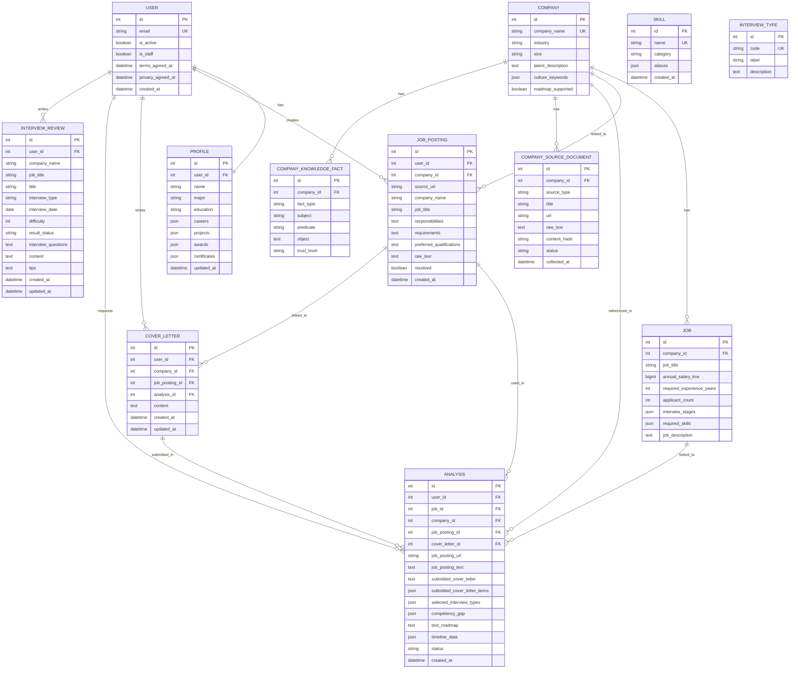

# 🧭 PathFinder AI — 취준생 맞춤형 면접 준비 로드맵 추천 서비스

> **서류 합격 이후, AI가 나만을 위한 면접 로드맵을 그려드립니다.**  
> 이력서·자기소개서·채용공고를 종합 분석해 직무별 맞춤 준비 전략을 자동 생성하는 서비스입니다.

---

## 📌 목차

| # | 섹션 |
|---|------|
| A | [팀원 정보 및 업무 분담](#-a-팀원-정보-및-업무-분담) |
| B | [목표 서비스 및 실제 구현 정도](#-b-목표-서비스-및-실제-구현-정도) |
| C | [데이터베이스 모델링 ERD](#-c-데이터베이스-모델링-erd) |
| D | [추천 알고리즘 기술 설명](#-d-추천-알고리즘-기술-설명) |
| E | [핵심 기능 설명](#-e-핵심-기능-설명) |
| F | [생성형 AI 활용](#-f-생성형-ai-활용) |
| H | [기타 — 학습 회고 및 설계 문서](#-h-기타--학습-회고-및-설계-문서) |
| + | [기술 스택](#-기술-스택) |
| + | [프로젝트 구조](#-프로젝트-구조) |
| + | [시작 가이드](#-시작-가이드-설치-및-실행) |
| + | [테스트 가이드](#-테스트-실행-가이드) |
| + | [데이터셋 & 파인튜닝](#-채용-데이터셋--파인튜닝-실습-jobs_careers) |

---

## 👥 A. 팀원 정보 및 업무 분담

| 이름 | 담당 영역 |
|------|-----------|
| 🎯**전호준** | 전체 아키텍처 설계, 백엔드 핵심 로직(Django · DRF · JWT), LLM 서버 FastAPI 구축, 프롬프트 엔지니어링, 분석 알고리즘 개발, Knowledge Graph 설계, E2E 테스트 |
| 🤝**황인서** | 프론트엔드 UI/UX 구현(Vue 3 · Pinia), 대시보드 차트 시각화(Chart.js), 커뮤니티 페이지, 로그인·프로필 화면, CSS 스타일링 |

### 세부 업무 분담표

| 기능 영역 | 전호준 (메인) | 황인서 (서브) |
|----------|--------------|--------------|
| 시스템 아키텍처 | ✅ 설계 | |
| Django 백엔드 API | ✅ 전담 | |
| FastAPI LLM 서버 | ✅ 전담 | |
| 프롬프트 엔지니어링 | ✅ 전담 | |
| Knowledge Graph / 기업 DB | ✅ 전담 | |
| BERT 파인튜닝 실습 | ✅ 전담 | |
| Vue 3 화면 구현 | 🔧 지원 | ✅ 메인 |
| Chart.js 대시보드 | | ✅ 전담 |
| 커뮤니티 UI | | ✅ 전담 |
| CSS / 반응형 디자인 | | ✅ 전담 |
| Playwright E2E 테스트 | ✅ 설계 | 🔧 지원 |
| 문서화 / 기획 | 🔧 지원 | 🔧 지원 |

---

## 🎯 B. 목표 서비스 및 실제 구현 정도

### 서비스 목표

서류 전형 합격 이후, 취업 준비생이 **어떤 면접 유형(기술/임원/PT)에 맞춰 무엇을 어떻게 준비해야 하는지** 개인 맞춤형 로드맵을 제안하는 AI 서비스입니다.

> **핵심 가치**: "나의 이력"과 "회사가 원하는 것"의 간극을 AI가 분석해 구체적 행동 계획으로 변환

### 구현 달성도

| 기능 | 계획 | 구현 | 달성도 |
|------|------|------|--------|
| 사용자 인증 (JWT) | ✅ | ✅ | 100% |
| 프로필 관리 (이력서 정보) | ✅ | ✅ | 100% |
| 채용공고 URL 스크래핑 | ✅ | ✅ (정적 HTML 한계 있음) | 80% |
| 자기소개서 입력 및 저장 | ✅ | ✅ | 100% |
| AI 로드맵 자동 생성 | ✅ | ✅ | 95% |
| 역량 Gap 분석 시각화 | ✅ | ✅ | 95% |
| 분석 히스토리 조회 | ✅ | ✅ | 100% |
| 채용시장 대시보드 (추가 기획) | ➕ | ✅ | 100% |
| 면접 후기 커뮤니티 | ➕ | ✅ | 100% |
| 기업 Knowledge Graph | ✅ | ✅ (Fixture 기반) | 85% |
| BERT 파인튜닝 데이터셋 | ✅ | ✅ | 100% |
| 실시간 DB/RAG 최신화 | ⬜ | ⬜ (MVP 이후 과제) | 0% |
| 이미지 생성 LLM (RPG 프로필) | ⬜ | ⬜ (MVP 이후 과제) | 0% |

### 계획 대비 주요 변경 사항

- ✅ **추가된 기능**: 채용시장 경쟁률 분석 대시보드 — 4종 인터랙티브 Chart.js 차트 + PNG 다운로드
- ✅ **추가된 기능**: 면접 후기 커뮤니티 — 후기 공유 플랫폼
- ✅ **고도화**: Knowledge Graph 기반 기업 정보 RAG 구조 (단순 DB 조회 → 벡터 유사도 기반 retrieval)
- ⚠️ **기술적 한계**: SPA 방식 채용 사이트(원티드, 쿠팡 등) HTML 스크래핑 한계 → 직접 입력 fallback 제공
- ⚠️ **미구현**: 실시간 DB/RAG 최신화, RPG 이미지 생성 (MVP 이후 로드맵)

---

## 🗄️ C. 데이터베이스 모델링 ERD



### 모델 설계 원칙

- **`accounts.User`** — 이메일 기반 커스텀 `AbstractBaseUser`. Django 기본 username 필드를 제거하고 email을 `USERNAME_FIELD`로 설정
- **`Profile`** — `careers`, `projects`, `awards`, `certificates`를 `JSONField`로 저장. 입력 필드 변화에 유연하게 대응
- **`Analysis`** — 분석 요청의 중심 엔티티. LLM 결과(`competency_gap`, `timeline_data`)를 JSON으로, 상태(`pending/done/failed`)를 추적
- **`CompanyKnowledgeFact`** — GraphRAG 스타일 삼중 구조(`subject`, `predicate`, `object`)로 기업 정보를 저장하여 LLM 컨텍스트에 주입

---

## 🧠 D. 추천 알고리즘 기술 설명

PathFinder AI의 로드맵 추천은 단순한 LLM 프롬프트 호출이 아니라, **다층 컨텍스트 구축 → 지식 그래프 검색 → LLM 생성 → 구조 정규화**의 파이프라인으로 동작합니다.

### 전체 파이프라인

```
사용자 입력
  │
  ├─ 채용공고 URL (httpx 스크래핑 → 텍스트 추출)
  ├─ 자기소개서 항목
  ├─ 면접 유형 선택
  └─ 프로필 (경력/프로젝트/자격증/수상)
         │
         ▼
  [Step 1] 검색 쿼리 생성
  build_retrieval_query()
  → 모든 입력을 단일 텍스트로 결합
         │
         ▼
  [Step 2] 스킬 택소노미 매칭
  _build_recommended_study_areas()
  → DB의 Skill 엔티티를 쿼리 텍스트와 키워드 매칭
  → 학습 추천 분야 리스트 생성
         │
         ▼
  [Step 3] Knowledge Graph Retrieval
  build_company_graph_context()
  → CompanyKnowledgeFact 테이블에서 유사도 기반 top-k 검색
  → 기업 인재상, 기술 스택, 문화 키워드, 최근 이슈 주입
         │
         ▼
  [Step 4] LLM 페이로드 조립
  build_llm_payload()
  → user_profile + job_info + company_info + company_graph_context 통합
  → X-Internal-Token 헤더로 FastAPI LLM 서버에 전달
         │
         ▼
  [Step 5] LLM 생성 (FastAPI + GPT-5-nano)
  SSAFY GMS API 경유 OpenAI 호출
  → 한국어 구조화 프롬프트
  → JSON 형식 응답 (regex fallback 파싱)
         │
         ▼
  [Step 6] 결과 정규화
  normalize_llm_result()
  → competency_gap, text_roadmap, timeline_data 검증 및 정제
  → Analysis 모델에 저장 (status: done)
```

### 역량 Gap 분석 (competency_gap)

LLM은 다음 4가지 상태로 각 역량을 분류합니다:

| 상태 | 의미 | UI 처리 |
|------|------|---------|
| `strength` / `어필 가능` | 직접 경험 있음, 강점으로 어필 | 🟢 성공색 배지 |
| `articulate` / `답변 정리` | 유사 경험 있음, 연결 전략 필요 | 🟡 경고색 배지 |
| `study` / `학습 필요` | 경험 없음, 개념부터 학습 | 🔴 위험색 배지 |
| `insufficient_data` / `판단 보류` | 판단 근거 부족 | ⚪ 중립색 배지 |

### Knowledge Graph 구조 (GraphRAG 방식)

```
Company ──┬── CompanyKnowledgeFact (사실 그래프)
          │     subject: "현대자동차"
          │     predicate: "주요기술"  
          │     object: "전동화 플랫폼 E-GMP"
          │
          ├── CompanySourceDocument (원본 문서)
          │     source_type: news / fixture / homepage
          │
          └── CompanySourceChunk (임베딩 청크)
                embedding_vector: [...] ← 유사도 검색
```

- `build_company_graph_context()` 함수가 retrieval_query와 기업 사실(Fact)을 매칭하여 **관련성 높은 사실만** LLM 컨텍스트에 포함
- 프롬프트 길이를 `LLM_MAX_PROMPT_CHARS=12,000`으로 제한하여 토큰 비용 최적화

### 스킬 택소노미 매칭

```python
# _build_recommended_study_areas() 로직 요약
for skill in Skill.objects.order_by('name'):
    # skill.name + skill.aliases를 쿼리 텍스트에서 키워드 검색
    if any(term.lower() in query_text_lower for term in [skill.name, *skill.aliases]):
        study_areas.append({'name': skill.name, 'category': skill.category})
```

Skill 엔티티는 `language / framework / database / infra / cs / soft_skill / domain` 7개 카테고리로 분류되어, 채용공고 텍스트에서 자동으로 학습 대상 기술을 추출합니다.

---

## ✨ E. 핵심 기능 설명

### 1️⃣ 홈 화면 (`/`)

- 로그인 전/후 상태를 분기하여 맞춤형 CTA(Call-to-Action) 제공
- 비로그인 시 서비스 소개 + 로그인 유도, 로그인 시 분석하기 · 대시보드 · 히스토리 바로가기 제공

---

### 2️⃣ 프로필 관리 (`/profile`)

사용자의 이력 정보를 구조화하여 AI 분석의 근거로 활용합니다.

| 입력 항목 | 설명 | 예시 |
|----------|------|------|
| **기본 정보** | 이름, 전공, 학력 | 컴퓨터공학과, 학사 졸업 |
| **경력** | 회사명, 직무, 주요 업무 및 성과 | 스타트업 A사, 백엔드 개발 |
| **프로젝트** | 프로젝트명, 역할, 기술스택, 결과 | AI 챗봇 개발, FastAPI, 정확도 92% 달성 |
| **자격증** | 자격증명 | 정보처리기사 |
| **수상내역** | 수상명, 수상 내용 | SSAFY 우수 프로젝트상 |

- 반복 항목(경력/프로젝트 등) 추가·삭제는 동일한 UI 패턴으로 통일
- 저장 시 **화면에 표시된 필드만 전송**하여 오래된 불필요 필드 정리

---

### 3️⃣ 분석 생성 → 로드맵 결과 (`/analyze/new` → `/analyze/:id`)

면접 준비 AI 로드맵을 생성하는 핵심 워크플로우입니다.

```
① 채용공고 입력 (URL 또는 본문 직접 입력)
        ↓
② 자기소개서 입력 (항목별 구조화 입력)
        ↓
③ 면접 유형 선택 (기술/임원/PT/기타)
        ↓
④ [분석 중] LLM 파이프라인 실행 (~30초)
        ↓
⑤ 결과 조회
   ├── 역량 분석 탭: 어필/답변정리/학습 역량 분류
   ├── 준비 항목 탭: 직무 지식별 핵심 개념 + 예상 질문
   └── 사이드바: 제출 자기소개서 원문 확인 (읽기 전용 모달)
```

**결과 화면 구조 (`/analyze/:id`):**

| 섹션 | 내용 |
|------|------|
| 분석 요약 | 회사명, 직무, 면접 유형, 생성 일시 |
| 역량 분석 | `어필 가능` / `답변 정리` / `학습 필요` 역량 배지 분포 |
| 준비 항목 (Timeline) | 담당업무 키워드 → 준비 근거 → 핵심 개념 → 예상 질문 체크리스트 |
| 진행률 | 예상 질문 체크 기반 준비 완료율 표시 |

---

### 4️⃣ 채용시장 경쟁률 분석 대시보드 (`/dashboard`)

10,000건 채용 데이터셋을 기반으로 시장 트렌드를 시각화합니다.

| 차트 | 유형 | 내용 |
|------|------|------|
| 산업별 평균 연봉 vs 지원자 수 | 이중 축 혼합 (Bar + Line) | 산업별 인기 트렌드와 진입 장벽 비교 |
| 직급별 지원자 분포 | 원형 도넛 (Doughnut) | 신입/대리/과장 등 채용 수요 비중 |
| 경력 요구조건 트렌드 | 라인 (Line) | 연도/분기별 경력 조건 변화 추이 |
| 급여 분포도 | 누적 버블/영역 | 업계 전체 대비 급여 밴드 분포 |

**인터랙티브 기능:**
- 🔍 **필터링**: 산업군 선택 + 경력 범위 Slider + 기업 검색창으로 모든 차트 동시 갱신
- 💾 **PNG 저장**: 시각화된 차트를 텍스트 손실 없이 PNG 파일로 다운로드

---

### 5️⃣ 면접 후기 커뮤니티 (`/community`)

구직자들이 자신의 면접 경험을 공유하는 소통 공간입니다.

| 기능 | 설명 |
|------|------|
| 후기 작성 | 회사명, 직무, 면접 유형, 날짜, 난이도(1-5), 합격 여부, 면접 질문, 준비 팁 기록 |
| 후기 상세 조회 | 다른 사용자의 후기를 읽고 면접 준비 참고 |
| 필터링 & 검색 | 회사명/직무/유형별 필터로 원하는 후기 탐색 |

---

### 6️⃣ 분석 히스토리 (`/history`)

과거에 생성된 AI 로드맵 목록을 보관하고 재조회할 수 있습니다.

- 생성 일시, 회사명, 직무, 면접 유형, 분석 상태(pending/done/failed)를 목록으로 표시
- 항목 클릭 시 `/analyze/:id`로 이동하여 상세 결과 재열람

---

## 🤖 F. 생성형 AI 활용

### 1. 핵심 — AI 면접 준비 로드맵 생성

**사용 모델**: `gpt-5-nano` via SSAFY GMS Gateway  
**엔드포인트**: `https://gms.ssafy.io/gmsapi/api.openai.com/v1/chat/completions`

```
백엔드 (Django)
  → build_llm_payload() : 사용자 정보 + 기업 KG + 채용공고 통합
  → X-Internal-Token 헤더 인증
  → FastAPI LLM 서버 POST /llm/roadmap
  → 한국어 구조화 프롬프트 조립 (roadmap_prompt.py)
  → SSAFY GMS API 호출 (gpt-5-nano)
  → JSON 응답 파싱 (regex fallback)
  → normalize_llm_result() 정규화
  → Analysis 저장
```

**프롬프트 설계 원칙:**
- 💡 역할 프리픽스: `"당신은 취업 면접 준비 전문 코치입니다"` 로 역할 고정
- 📋 구조화된 JSON 출력 강제: `competency_gap`, `timeline_data`, `text_roadmap` 필드 명세 제공
- 🔗 Evidence 기반 분석: 추측 금지, 프로필에서 실제 경험 인용 강제
- ⚖️ 역량 4분류 지시: `strength / articulate / study / insufficient_data` 명확 정의

**LLM 출력 구조:**
```json
{
  "competency_gap": {
    "어필 가능": ["Docker", "FastAPI"],
    "답변 정리": ["Kubernetes"],
    "학습 필요": ["gRPC", "Kafka"]
  },
  "text_roadmap": "2주 집중 준비 전략 텍스트...",
  "timeline_data": [
    {
      "category": "백엔드 심화",
      "subtopics": [
        {
          "title": "Kafka 메시지 큐",
          "question": "메시지 큐를 도입한 이유를 설명해주세요",
          "answer_guide": "...",
          "evidence": "프로젝트 경험 없음 → 학습 우선",
          "follow_up_questions": ["처리량 보장 방법은?"]
        }
      ]
    }
  ]
}
```

### 2. 기업 지식 그래프 구축 (GraphRAG)

- 기업 공식 홈페이지, 뉴스, 공개 리포트를 수집하여 `CompanySourceDocument` 저장
- 텍스트를 청크로 분할 → `CompanySourceChunk`에 저장, 임베딩 벡터 생성
- `CompanyKnowledgeClaim` → `CompanyKnowledgeFact` 파이프라인으로 검증된 사실 추출
- LLM 호출 시 검색 쿼리와 유사도 높은 사실을 자동으로 컨텍스트에 주입

### 3. 채용공고 텍스트 자동 추출

- `httpx + BeautifulSoup` 기반 정적 HTML 스크래핑
- `script / style / nav / footer` 태그 제거 후 순수 텍스트 추출
- 최대 `8,000자`로 절단하여 LLM 프롬프트에 포함

> ⚠️ **한계**: 원티드, 쿠팡잡 등 SPA 렌더링 사이트는 JavaScript 실행 없이 본문을 가져올 수 없어, 직접 입력 fallback UI를 제공합니다.

### 4. BERT 파인튜닝 실습 (`/jobs_careers`)

- **데이터셋**: 10,000건 채용 공고 JSONL (`jobs_careers.jsonl`)
- **모델**: `bert-base-multilingual-cased` (허깅페이스)
- **태스크**: 채용 조건(직무/산업/연봉/경력)으로부터 지원자 수(`applicant_count`) 회귀 예측
- **활용 목적**: 대시보드 차트의 기반 데이터 생성 및 AI 기반 채용 트렌드 분석 시뮬레이션

---

## 🛠 기술 스택

### Frontend
| 분류 | 기술 |
|------|------|
| 프레임워크 | Vue 3 (Composition API) + Vite |
| 상태 관리 | Pinia |
| 라우팅 | Vue Router |
| HTTP 통신 | Axios (JWT 자동 갱신 인터셉터) |
| 시각화 | Chart.js |
| 스타일링 | Vanilla CSS + Tailwind CSS |
| 테스트 | Playwright (E2E) |

### Backend
| 분류 | 기술 |
|------|------|
| 프레임워크 | Django 5.2 + Django REST Framework |
| 인증 | SimpleJWT (Access + Refresh Token) |
| 커스텀 모델 | `accounts.User` (AbstractBaseUser) |
| DB | SQLite (개발) |
| HTML 파싱 | BeautifulSoup4 + httpx |
| 테스트 | pytest-django |

### LLM Server
| 분류 | 기술 |
|------|------|
| 프레임워크 | FastAPI |
| LLM API | OpenAI (gpt-5-nano) via SSAFY GMS |
| HTTP | httpx (비동기) |
| 보안 | X-Internal-Token 헤더 인증 |
| 테스트 | pytest (monkeypatch + AsyncMock) |

---

## 📂 프로젝트 구조

```text
t08_project/
├── backend/                   # Django 백엔드 API 서버 (Port 8080)
│   ├── accounts/              # 사용자 계정 · 프로필 (Auth + Profile)
│   ├── analysis/              # 로드맵 생성 · LLM 연동 핵심 로직
│   ├── community/             # 면접 후기 커뮤니티
│   ├── companies/             # 기업 정보 · Knowledge Graph
│   │   ├── knowledge.py       # GraphRAG 검색 로직
│   │   ├── embeddings.py      # 벡터 임베딩 생성
│   │   └── data_loader.py     # 기업 데이터 적재
│   └── config/                # Django 설정 (settings.py, urls.py)
│
├── frontend/                  # Vue 3 / Vite 프론트엔드 (Port 5173)
│   ├── src/
│   │   ├── views/             # 페이지 컴포넌트 (Home, Profile, Analyze, Dashboard, ...)
│   │   ├── components/        # 재사용 컴포넌트 (result/*, profile/*)
│   │   ├── stores/            # Pinia 상태 (auth.js, ...)
│   │   ├── api/               # Axios 인스턴스 + JWT 인터셉터
│   │   └── composables/       # 재사용 로직 (useRoadmapProgress, useJobsData)
│   └── tests/e2e/             # Playwright E2E 테스트 스펙
│
├── llm_server/                # FastAPI LLM 서버 (Port 8081)
│   ├── main.py                # API 엔드포인트 + 인증 미들웨어
│   └── roadmap_prompt.py      # 한국어 프롬프트 빌더
│
├── jobs_careers/              # 10K 채용 데이터셋 + BERT 파인튜닝
├── docs/                      # 기획 · 설계 · 테스트 문서
├── scripts/                   # 개발 서버 자동화 스크립트
└── run-dev.bat                # 원클릭 로컬 개발 서버 기동
```

---

## 🔌 시작 가이드 (설치 및 실행)

### 사전 준비사항

- **Python 3.11** (`py -3.11`, `py -3`, 또는 `python` 명령어로 접근 가능해야 함)
- **Node.js** (npm 포함)가 시스템 PATH에 설정되어 있어야 함
- 처음 실행 시 의존성 라이브러리 다운로드를 위한 인터넷 연결 필요

### 실행 방법 (Windows 환경)

프로젝트 루트 디렉토리에서 `run-dev.bat` 배치 파일을 실행합니다.

```bash
# 기본 실행 (mock LLM 응답)
.\run-dev.bat

# 실제 AI 응답 (GMS_KEY 필요)
set GMS_KEY="your_gms_api_key"
.\run-dev.bat
```

**`run-dev.bat` 실행 시 자동 처리 내용:**
1. 백엔드 · LLM 서버용 Python 가상환경 자동 생성 및 `requirements.txt` 설치
2. 프론트엔드 패키지 자동 설치 (`npm install`)
3. Django 데이터베이스 마이그레이션 실행
4. 프론트엔드 · 백엔드 · LLM 서버 동시 기동 및 포트 헬스체크
5. `Ctrl+C` 입력 시 전체 서버 안전 종료

### 로컬 서버 포트

| 서버 | 포트 | URL |
|------|------|-----|
| Vue/Vite 프론트엔드 | 5173 | http://127.0.0.1:5173 |
| Django 백엔드 | 8080 | http://127.0.0.1:8080 |
| FastAPI LLM 서버 | 8081 | http://127.0.0.1:8081 |

### 환경 변수 정리

| 변수 | 용도 | 기본값 |
|------|------|--------|
| `GMS_KEY` | SSAFY GMS LLM API 키 | (없으면 Mock 응답) |
| `LLM_INTERNAL_TOKEN` | 백엔드↔LLM 서버 인증 토큰 | 자동 생성 (로그 출력) |
| `LLM_MAX_PROMPT_CHARS` | 최대 프롬프트 길이 | `12000` |
| `LLM_MAX_REQUEST_BYTES` | 최대 요청 바디 크기 | `2621440` (2.5 MB) |
| `LLM_ALLOWED_CLIENT_HOSTS` | LLM 서버 IP 화이트리스트 | `127.0.0.1,::1,testclient` |
| `DJANGO_SECRET_KEY` | Django 시크릿 키 | 개발용 fallback |
| `DJANGO_DEBUG` | 디버그 모드 | `true` |
| `LLM_SERVER_URL` | 백엔드→LLM 서버 URL | `http://127.0.0.1:8081` |
| `DJANGO_CORS_ALLOWED_ORIGINS` | CORS 허용 오리진 | `localhost:5173` |

---

## 🧪 테스트 실행 가이드

### 1. 백엔드 단위 테스트 (pytest-django)

```bash
cd backend
python -m pytest
# → 28 passed ✅
```

`accounts`, `analysis`, `community`, `companies` 앱의 모델 · API · 비즈니스 로직 검증

### 2. LLM 서버 단위 테스트 (pytest)

```bash
cd llm_server
python -m pytest
# → 9 passed ✅
```

`monkeypatch` + `AsyncMock`으로 GMS API 호출을 모킹하여 엔드포인트 · 인증 · 파싱 로직 검증

### 3. 프론트엔드 E2E 테스트 (Playwright)

```bash
cd frontend
npx playwright test
# → 5 passed ✅
```

> ⚠️ 3개 개발 서버가 모두 실행 중이어야 합니다.

| 스펙 파일 | 검증 내용 |
|----------|----------|
| `analyze-flow.spec.js` | 분석 생성 → 결과 로드맵 추천 전체 흐름 |
| `dashboard.spec.js` | 대시보드 렌더링 · 다크모드 전환 · PNG 다운로드 |

### 테스트 결과 요약

| 구분 | 테스트 수 | 결과 |
|------|-----------|------|
| 백엔드 (pytest-django) | 28 | ✅ ALL PASSED |
| LLM 서버 (pytest) | 9 | ✅ ALL PASSED |
| 프론트엔드 E2E (Playwright) | 5 | ✅ ALL PASSED |
| **합계** | **42** | **✅ ALL PASSED** |

---

## 📊 채용 데이터셋 & 파인튜닝 실습 (`/jobs_careers`)

### 데이터셋 (`jobs_careers.jsonl`)

- **규모**: 10,000건의 채용 공고 데이터
- **필드 구성**:

| 필드 | 설명 |
|------|------|
| `job_title` | 직무명 |
| `industry` | 산업군 |
| `company_name` | 회사명 |
| `annual_salary_krw` | 평균 연봉 (원) |
| `required_experience_years` | 요구 경력 연수 |
| `applicant_count` | 평균 지원자 수 |

### BERT 파인튜닝 실습

- **모델**: `bert-base-multilingual-cased` (허깅페이스 허브)
- **태스크**: 회귀 예측 — 채용 조건에서 `applicant_count` 예측
- **목적**: 대시보드 차트 데이터 생성 + AI 기반 채용 경쟁률 시뮬레이션

> 상세 내용: [jobs_careers/README.md](./jobs_careers/README.md)

---

## 📝 H. 기타 — 학습 회고 및 설계 문서

### 📚 구현 과정 중 학습한 내용

#### 전호준 (메인)

| 주제 | 내용 |
|------|------|
| **FastAPI 비동기 패턴** | `httpx.AsyncClient`와 Django `async_to_sync` 조합으로 LLM 서버와의 비동기 통신 구현 |
| **JWT 보안 아키텍처** | Access/Refresh 토큰 분리, `X-Internal-Token` 내부 인증 계층 설계의 중요성 |
| **GraphRAG 설계** | 삼중 구조(subject-predicate-object)로 기업 지식을 표현하고 유사도 검색으로 LLM 컨텍스트에 주입하는 패턴 |
| **프롬프트 엔지니어링** | 한국어 구조화 출력 강제, JSON 스키마 명세 제공으로 hallucination 감소 |
| **SSRF 방어** | URL 스크래핑 시 사설 IP / 루프백 / localhost 차단 로직 구현 |

#### 황인서 (서브)

| 주제 | 내용 |
|------|------|
| **Vue 3 Composition API** | `ref`, `computed`, `watch`, `composable` 패턴으로 복잡한 상태 관리 |
| **Chart.js 인터랙티브** | 이중 축 혼합 차트, 도넛 차트, 필터 연동으로 동적 데이터 시각화 |
| **Pinia 상태 관리** | `auth` 스토어 기반 JWT 상태 전역 공유 및 라우터 가드 연동 |
| **반응형 CSS 설계** | Vanilla CSS 변수 기반 테마 시스템, 모바일/태블릿/데스크톱 분기 |

### ⚠️ 어려웠던 부분 및 해결 과정

| 어려움 | 해결 방법 |
|--------|----------|
| LLM 응답 JSON 파싱 실패 | `regex` 기반 fallback 파서 추가, `normalize_llm_result()`로 타입 강제 정규화 |
| SPA 채용 사이트 스크래핑 불가 | 직접 텍스트 입력 UI fallback 추가, 사용자에게 명시적 안내 |
| LLM 서버 ↔ 백엔드 인증 | `X-Internal-Token` 환경변수 기반 내부 토큰 시스템 설계 |
| Playwright 테스트 API 의존성 | `page.route()` 기반 API 모킹으로 서버 없이도 UI 흐름 검증 가능 |
| 프롬프트 토큰 초과 | 채용공고 8,000자, 전체 프롬프트 12,000자 하드 캡 설정 |

### 💡 새로 배운 것들

- `AbstractBaseUser`를 활용한 Django 커스텀 인증 모델 설계 방법
- FastAPI의 `Depends()` 미들웨어 패턴과 내부 API 보안 설계
- Knowledge Graph + RAG 조합으로 LLM에 외부 지식 주입하는 GraphRAG 패턴
- `bert-base-multilingual-cased` 파인튜닝을 통한 회귀 예측 모델 훈련
- Playwright의 `page.route()` 모킹으로 외부 의존성 없는 E2E 테스트 설계

### 📋 기획 및 설계 문서 목록

| 문서 | 내용 |
|------|------|
| [요구사항.md](./docs/요구사항.md) | 서비스 목표, 기능 요건, 제약 사항 |
| [DESIGN.md](./DESIGN.md) | UI/UX 디자인 원칙, 컴포넌트 계약, 접근성 기준 |
| [docs/DESIGN.md](./docs/DESIGN.md) | 상세 화면별 디자인 명세 |
| [런칭_준비도_점검.md](./docs/런칭_준비도_점검.md) | 서비스 완성도 점검, 보완 과제 목록 |
| [test_report.md](./docs/test_report.md) | E2E 테스트 결과 및 버그 분석 보고서 |
| [14-2_LLM파트_분석.md](./docs/14-2_LLM파트_분석.md) | LLM 서버 아키텍처 분석 |
| [15- LLM 고도화 2차.md](./docs/15-%20LLM%20고도화%202차.md) | LLM 프롬프트 고도화 계획 |

### 🔮 향후 개선 방향 (MVP 이후 로드맵)

```
Phase 2 (단기)
├── 운영 DB PostgreSQL 전환
├── Celery 비동기 분석 작업 큐 도입
├── 프론트 API URL 환경변수화 (localhost 제거)
└── SSRF 방어 강화 (허용 도메인 기반 스크래핑)

Phase 3 (중기)
├── 실시간 기업 데이터 크롤링 + RAG 최신화 파이프라인
├── Headless Chrome 기반 SPA 스크래핑 지원
├── 이미지 생성 LLM (RPG 스타일 사용자 프로필 아바타)
└── 실통합 테스트 (실 서버 + 브라우저 smoke test)
```

---

<div align="center">

**🧭 PathFinder AI** — *당신의 합격을 위한 가장 정확한 길을 찾아드립니다*

팀 T08 | SSAFY 15기 | 2026

</div>
