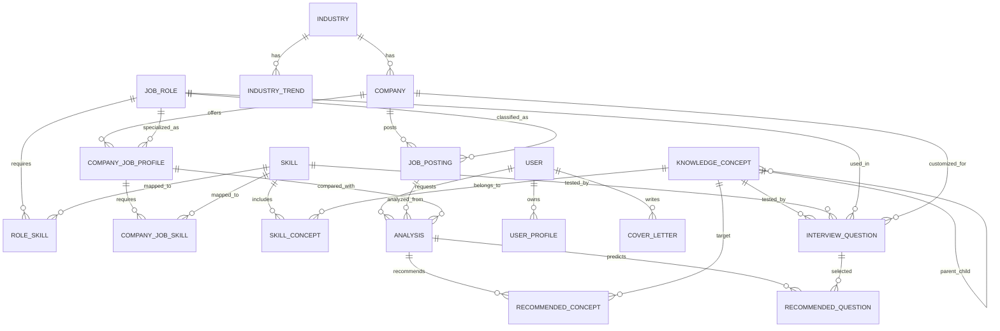

# PathFinder AI 데이터베이스 설계

## 목적

PathFinder AI의 핵심 목적은 사용자가 채용공고와 자기소개서, 프로필 정보를 입력했을 때 면접 준비에 필요한 직무 지식, 학습 우선순위, 예상 면접 질문을 추천해 면접 준비 시간을 줄이는 것이다.

이를 위해 데이터베이스는 단순히 회사명, 직무명, 산업명을 저장하는 수준을 넘어 다음 흐름을 구조화해야 한다.

```text
회사 -> 산업 -> 직무 -> 요구역량 -> 학습개념 -> 예상질문
```

LLM은 모든 내용을 임의로 생성하는 역할이 아니라, 데이터베이스에 구축된 기업/산업/직무/역량/개념/질문 데이터를 바탕으로 사용자 상황에 맞게 분석하고 설명하는 역할을 맡는 것이 바람직하다.

## 핵심 활용 시나리오

사용자가 채용공고와 자기소개서를 입력하면 백엔드는 다음 정보를 조합해 분석한다.

- 지원 회사가 어떤 산업에 속하는지
- 해당 산업의 현재 흐름과 중요한 이슈가 무엇인지
- 산업 흐름 안에서 해당 직무가 어떤 역할을 수행해야 하는지
- 해당 회사/직무에서 중요하게 보는 역량이 무엇인지
- 사용자의 프로필과 자기소개서에서 드러나는 강점과 부족한 점이 무엇인지
- 부족한 역량을 보완하기 위해 어떤 개념을 먼저 학습해야 하는지
- 해당 개념과 관련해 어떤 면접 질문이 예상되는지

## 핵심 ERD



## 주요 테이블 설계

## 1. 산업 데이터

산업 데이터는 기업과 직무를 해석하는 배경 지식으로 사용된다. 예를 들어 커머스 산업에서는 대규모 트래픽, 물류 최적화, 재고 관리, 추천 시스템 등이 중요할 수 있고, 금융 산업에서는 보안, 안정성, 규제 준수, 트랜잭션 정합성이 중요할 수 있다.

### Industry

| 필드 | 설명 |
|---|---|
| `id` | PK |
| `name` | IT, 금융, 제조, 커머스, 게임, 바이오 등 산업명 |
| `description` | 산업 설명 |
| `market_summary` | 현재 산업 현황 요약 |
| `key_drivers` | 성장 요인 |
| `risks` | 리스크, 규제, 침체 요인 |
| `important_keywords` | AI, 클라우드, 보안, 비용절감 등 핵심 키워드 |
| `updated_at` | 최신화 일자 |

### IndustryTrend

| 필드 | 설명 |
|---|---|
| `id` | PK |
| `industry_id` | Industry FK |
| `period` | 2025-H1, 2026-Q1 등 기간 |
| `trend_title` | 산업 흐름 제목 |
| `trend_summary` | 흐름 설명 |
| `impact_on_jobs` | 직무에 주는 영향 |
| `source_name` | 출처명 |
| `source_url` | 출처 URL |
| `importance` | 1~5 중요도 |

## 2. 회사 데이터

회사 데이터는 같은 직무라도 회사별로 준비 방향이 달라지도록 만드는 기준 데이터다.

### Company

| 필드 | 설명 |
|---|---|
| `id` | PK |
| `industry_id` | Industry FK |
| `name` | 회사명 |
| `size` | 대기업, 중견기업, 스타트업 등 |
| `business_summary` | 사업 개요 |
| `main_products` | 주요 서비스/제품 |
| `business_model` | 수익 모델 |
| `tech_keywords` | 기술/플랫폼 키워드 |
| `culture_keywords` | 조직문화 키워드 |
| `talent_profile` | 인재상 |
| `recent_issues` | 최근 이슈 |
| `homepage_url` | 홈페이지 URL |
| `career_url` | 채용 페이지 URL |

예를 들어 같은 백엔드 개발자라도 쿠팡은 물류/커머스 맥락에서 대규모 트래픽과 주문/배송 안정성이 중요하고, 금융사는 보안과 트랜잭션 정합성이 더 중요할 수 있다.

## 3. 직무 데이터

직무 데이터는 회사와 무관하게 일반적인 직무 정의를 저장한다.

### JobRole

| 필드 | 설명 |
|---|---|
| `id` | PK |
| `name` | 백엔드 개발자, 프론트엔드 개발자, 데이터 분석가 등 |
| `category` | 개발, 데이터, 기획, 디자인 등 |
| `description` | 직무 설명 |
| `main_responsibilities` | 일반적인 주요 업무 |
| `seniority_level` | 신입, 주니어, 미들 등 |
| `common_interview_types` | 기술면접, 코딩테스트, PT 등 |

## 4. 회사별 직무 프로필

회사별 직무 프로필은 가장 중요한 테이블이다. 같은 직무라도 회사, 산업, 사업 모델에 따라 요구 역량이 달라지기 때문이다.

### CompanyJobProfile

| 필드 | 설명 |
|---|---|
| `id` | PK |
| `company_id` | Company FK |
| `job_role_id` | JobRole FK |
| `title` | 회사 채용 직무명 |
| `role_summary` | 이 회사에서 이 직무가 수행하는 역할 |
| `responsibilities` | 주요 업무 |
| `required_experience` | 요구 경력 |
| `required_skills_text` | 요구 기술 원문 |
| `preferred_skills_text` | 우대사항 원문 |
| `interview_process` | 면접 단계 |
| `evaluation_focus` | 평가 포인트 |
| `industry_context` | 산업 흐름상 이 직무가 중요한 이유 |

예시 데이터 방향은 다음과 같다.

| 항목 | 예시 |
|---|---|
| 회사 | 쿠팡 |
| 산업 | 커머스/물류 |
| 직무 | 백엔드 개발자 |
| 산업 흐름 | 빠른 배송, 물류 자동화, 대규모 트래픽 |
| 직무 역할 | 주문/배송/재고 시스템 안정화 |
| 중요 역량 | 대용량 트래픽, 분산 시스템, DB 트랜잭션, 장애 대응 |

## 5. 역량 데이터

역량 데이터는 직무와 학습 개념 사이의 중간 계층이다.

### Skill

| 필드 | 설명 |
|---|---|
| `id` | PK |
| `name` | REST API, DB 트랜잭션, Spring, Django, Redis 등 |
| `skill_type` | language, framework, cs, infra, domain 등 |
| `description` | 설명 |
| `difficulty` | beginner, intermediate, advanced 등 |

### RoleSkill

| 필드 | 설명 |
|---|---|
| `id` | PK |
| `job_role_id` | JobRole FK |
| `skill_id` | Skill FK |
| `importance` | 1~5 중요도 |
| `required_level` | 요구 숙련도 |
| `reason` | 해당 직무에서 중요한 이유 |

### CompanyJobSkill

| 필드 | 설명 |
|---|---|
| `id` | PK |
| `company_job_profile_id` | CompanyJobProfile FK |
| `skill_id` | Skill FK |
| `importance` | 회사/공고 기준 중요도 |
| `evidence` | 채용공고 또는 기업 분석에서 확인된 근거 문장 |

## 6. 학습 개념 데이터

학습 개념 데이터는 사용자에게 실제로 무엇을 공부해야 하는지 알려주기 위한 핵심 데이터다.

### KnowledgeConcept

| 필드 | 설명 |
|---|---|
| `id` | PK |
| `parent_id` | 자기참조 FK |
| `name` | 인덱스, 트랜잭션, HTTP, JWT, ORM 등 |
| `summary` | 개념 요약 |
| `description` | 상세 설명 |
| `difficulty` | 1~5 난이도 |
| `estimated_hours` | 예상 학습 시간 |
| `prerequisites` | 선행 개념 |
| `study_order` | 기본 학습 순서 |

### SkillConcept

| 필드 | 설명 |
|---|---|
| `id` | PK |
| `skill_id` | Skill FK |
| `concept_id` | KnowledgeConcept FK |
| `priority` | 해당 역량 학습 시 우선순위 |
| `reason` | 연결 이유 |

예를 들어 Database 역량은 트랜잭션, 인덱스, 정규화, 락, 격리수준, 쿼리 최적화 개념과 연결될 수 있다.

## 7. 면접 질문 데이터

면접 질문 데이터는 예상 질문 추천의 근거 데이터다.

### InterviewQuestion

| 필드 | 설명 |
|---|---|
| `id` | PK |
| `concept_id` | KnowledgeConcept FK |
| `skill_id` | Skill FK |
| `job_role_id` | JobRole FK, nullable |
| `company_id` | Company FK, nullable |
| `question_type` | technical, experience, project, culture, pt 등 |
| `difficulty` | 1~5 난이도 |
| `question` | 질문 본문 |
| `answer_guide` | 답변 방향 |
| `evaluation_points` | 평가 포인트 |
| `follow_up_questions` | 꼬리질문 |
| `bad_answer_patterns` | 피해야 할 답변 패턴 |
| `source` | 출처 또는 작성 근거 |

예시는 다음과 같다.

| 항목 | 예시 |
|---|---|
| 개념 | DB 인덱스 |
| 질문 | 인덱스를 사용하면 항상 조회 성능이 좋아지나요? |
| 평가 포인트 | B-Tree 구조, selectivity, write overhead, 실행계획 이해 |
| 꼬리질문 | 복합 인덱스에서 컬럼 순서는 왜 중요한가요? |

## 8. 채용공고 데이터

채용공고 데이터는 사용자가 입력한 공고를 저장하고 분석 재사용 가능성을 높이기 위해 필요하다.

### JobPosting

| 필드 | 설명 |
|---|---|
| `id` | PK |
| `company_id` | Company FK, nullable |
| `job_role_id` | JobRole FK, nullable |
| `source_url` | 공고 URL |
| `title` | 공고 제목 |
| `raw_text` | 원문 |
| `responsibilities` | 파싱된 주요 업무 |
| `requirements` | 파싱된 자격요건 |
| `preferred_qualifications` | 파싱된 우대사항 |
| `parsed_skills` | 추출된 기술 키워드 |
| `posted_at` | 게시일 |
| `closed_at` | 마감일 |
| `created_at` | 저장일 |

MVP에서는 채용공고 자동 파싱이 실패할 가능성이 크므로 사용자가 직접 입력한 공고 본문도 `raw_text`에 저장하는 방식이 안전하다.

## 9. 사용자 분석 데이터

분석 데이터는 사용자의 입력과 추천 결과를 저장한다.

### Analysis

| 필드 | 설명 |
|---|---|
| `id` | PK |
| `user_id` | User FK |
| `job_posting_id` | JobPosting FK |
| `company_job_profile_id` | CompanyJobProfile FK, nullable |
| `submitted_cover_letter` | 제출 자기소개서 |
| `selected_interview_types` | 선택 면접 유형 |
| `status` | pending, processing, done, failed |
| `strength_summary` | 사용자 강점 요약 |
| `gap_summary` | 부족한 역량 요약 |
| `roadmap_text` | 전체 로드맵 |
| `created_at` | 생성일 |

### RecommendedConcept

| 필드 | 설명 |
|---|---|
| `id` | PK |
| `analysis_id` | Analysis FK |
| `concept_id` | KnowledgeConcept FK |
| `priority` | 학습 우선순위 |
| `reason` | 추천 이유 |
| `current_level` | 현재 수준 추정 |
| `target_level` | 목표 수준 |
| `study_days` | 권장 학습 기간 |

### RecommendedQuestion

| 필드 | 설명 |
|---|---|
| `id` | PK |
| `analysis_id` | Analysis FK |
| `question_id` | InterviewQuestion FK |
| `priority` | 우선순위 |
| `reason` | 예상 질문으로 선정한 이유 |
| `related_cover_letter_point` | 자기소개서의 어떤 내용과 연결되는지 |

## MVP 우선순위

처음부터 모든 데이터를 완성하기보다 서비스 목적을 검증할 수 있는 최소 데이터부터 구축하는 것이 좋다.

| 우선순위 | 테이블 | 이유 |
|---|---|---|
| 1 | `Industry` | 회사와 직무를 산업 맥락에서 해석하기 위한 기준 |
| 2 | `Company` | 기업별 분석의 기준 |
| 3 | `JobRole` | 일반 직무 정의 |
| 4 | `CompanyJobProfile` | 회사별 직무 차이를 반영하는 핵심 데이터 |
| 5 | `Skill` | 직무 요구 역량 분류 |
| 6 | `KnowledgeConcept` | 실제 학습 추천 대상 |
| 7 | `RoleSkill` | 직무와 역량 연결 |
| 8 | `SkillConcept` | 역량과 학습 개념 연결 |
| 9 | `InterviewQuestion` | 예상 질문 추천 근거 |
| 10 | `JobPosting` | 사용자가 입력한 공고 저장 및 재분석 |
| 11 | `Analysis` | 분석 요청과 결과 저장 |
| 12 | `RecommendedConcept` | 개인화 학습 개념 추천 결과 |
| 13 | `RecommendedQuestion` | 개인화 예상 질문 추천 결과 |

## 현재 프로젝트 모델과의 차이

현재 프로젝트에는 주로 다음 모델이 존재한다.

- `Company`
- `Job`
- `Profile`
- `Analysis`

현재 `Job` 모델에는 직무 정보, 연봉, 지원자 수, 면접 단계, 요구 스킬, 추천 학습 분야 등이 한꺼번에 들어 있다. 실제 서비스 목적을 달성하려면 이를 다음처럼 분리하는 것이 좋다.

| 현재 개념 | 개선 방향 |
|---|---|
| `Job` | `JobRole`, `CompanyJobProfile`, `JobPosting`으로 분리 |
| `required_skills` JSON | `Skill`, `RoleSkill`, `CompanyJobSkill`로 구조화 |
| `recommended_study_areas` JSON | `KnowledgeConcept`, `SkillConcept`로 구조화 |
| `timeline_data` JSON | `RecommendedConcept`, `RecommendedQuestion`로 일부 정규화 |

## 기획안 반영 문구

기획안에는 다음 방향으로 표현하는 것이 적절하다.

> 본 서비스는 기업/산업/직무/역량/학습개념/면접질문으로 이어지는 구조화된 지식 DB를 구축하고, 사용자의 채용공고 및 자기소개서 입력을 이 DB와 매칭하여 개인화된 면접 준비 로드맵을 제공한다.

> 단순 LLM 생성이 아니라, 사전 구축된 직무 지식 그래프와 기업/산업 맥락 데이터를 기반으로 학습 우선순위와 예상 질문을 추천한다.

## 결론

PathFinder AI의 데이터베이스는 회사와 직무 목록을 저장하는 단순 카탈로그가 아니라 면접 준비를 위한 직무 지식 그래프에 가까워야 한다.

가장 중요한 데이터는 `CompanyJobProfile`, `Skill`, `KnowledgeConcept`, `InterviewQuestion`이다. 이 네 가지가 충분히 구축되어야 사용자는 단순한 로드맵이 아니라 실제 면접 준비에 필요한 학습 순서와 예상 질문을 받을 수 있다.
