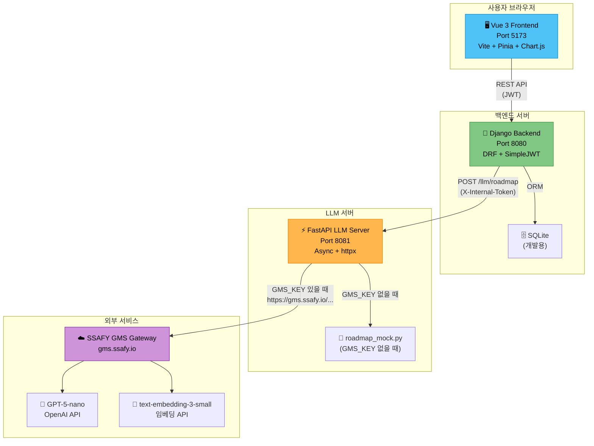
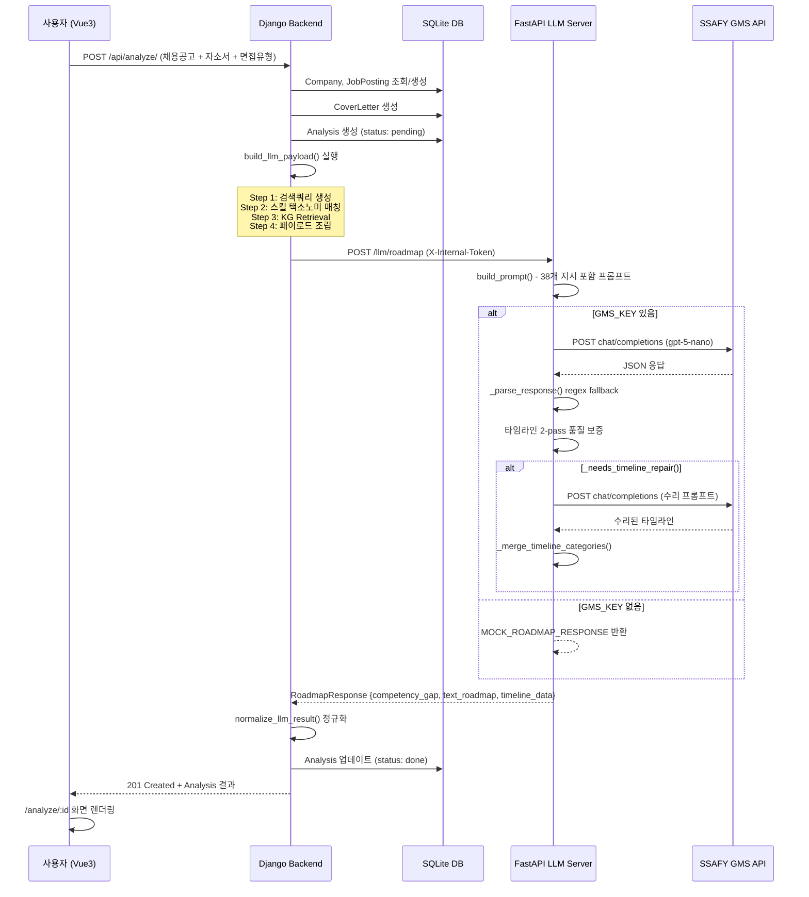
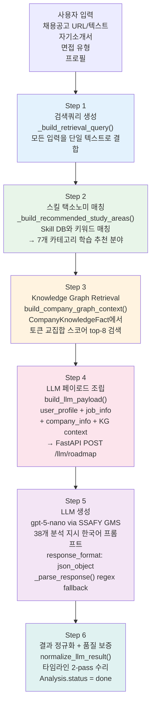
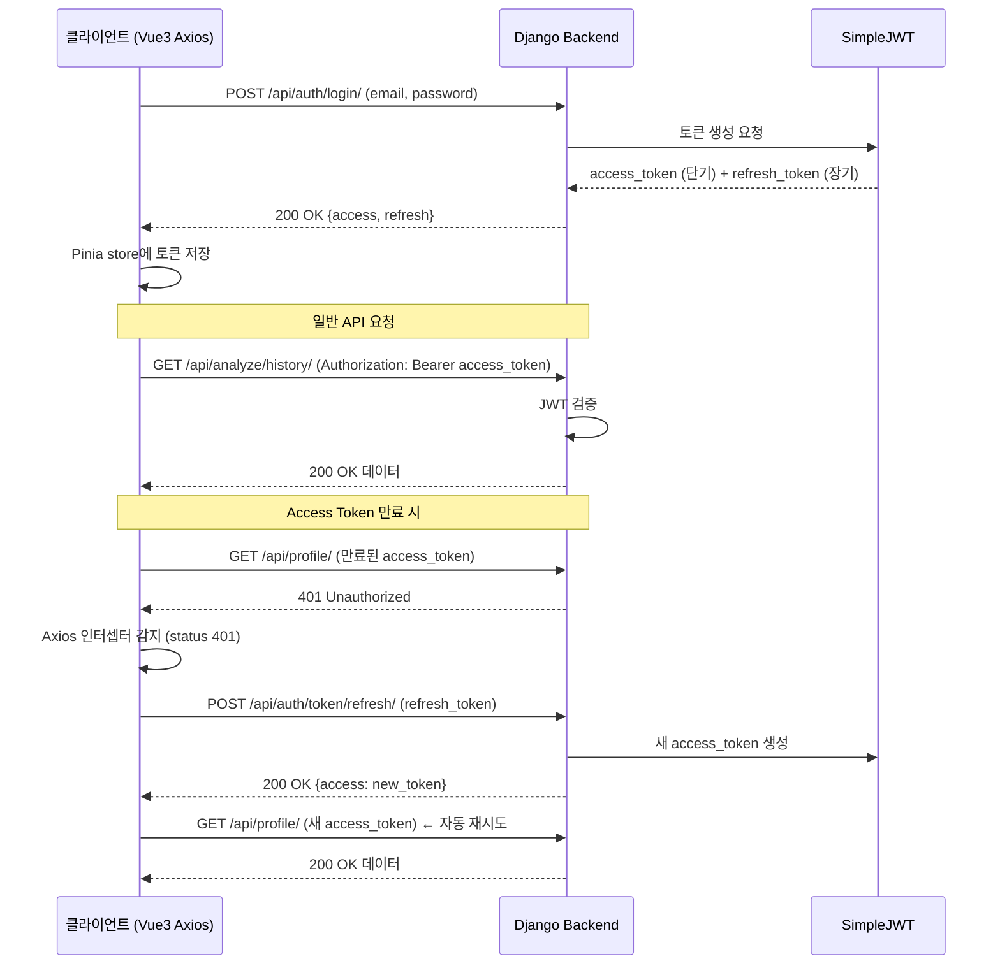
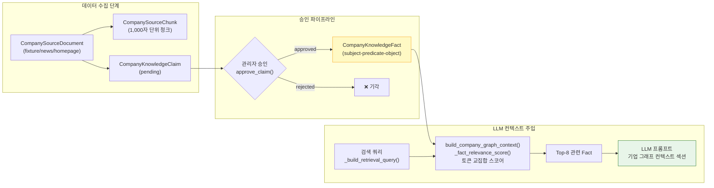
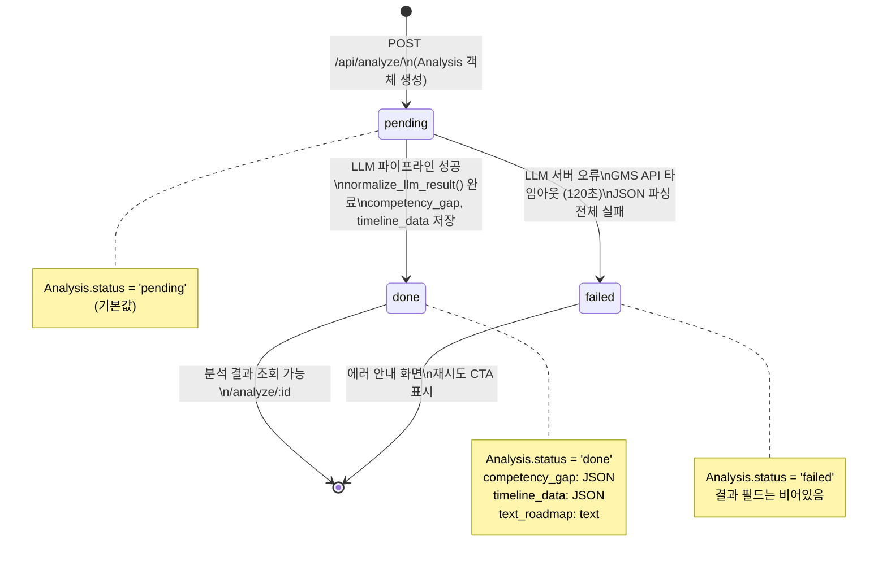
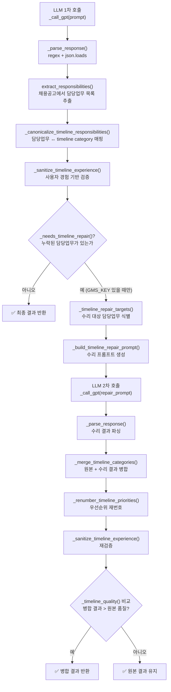
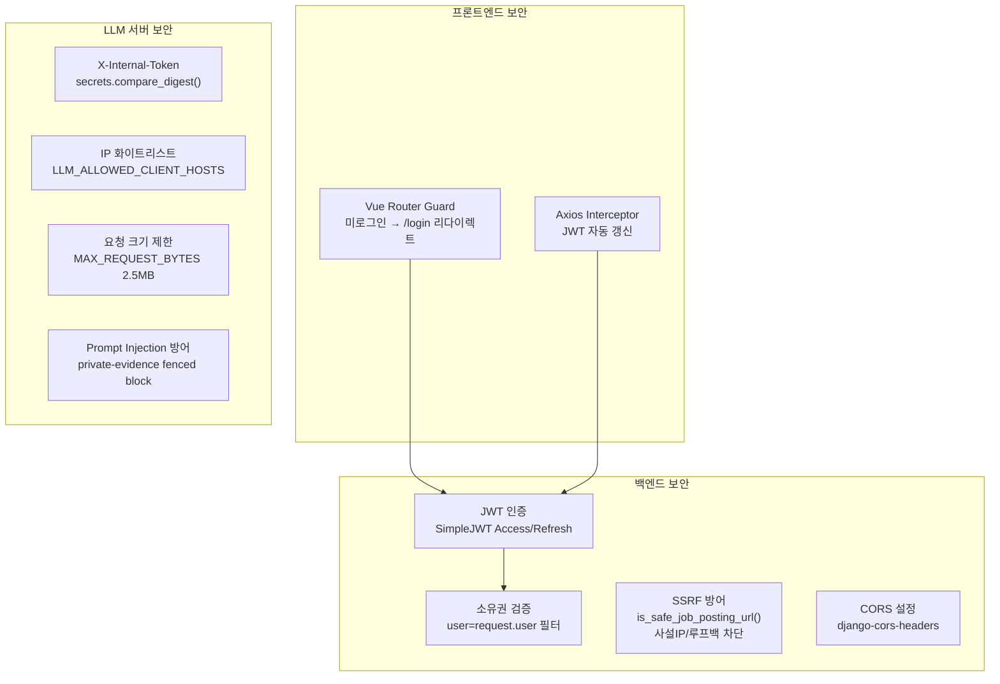

# 🏗️ PathFinder AI — 시스템 아키텍처 명세서

> **버전**: v1.0  
> **작성일**: 2026-06-26  
> **작성자**: 전호준 (아키텍처 설계 담당)

---

## 목차

1. [전체 시스템 구성도](#1-전체-시스템-구성도)
2. [서비스 계층 설명](#2-서비스-계층-설명)
3. [AI 분석 시퀀스 다이어그램](#3-ai-분석-시퀀스-다이어그램)
4. [LLM 파이프라인 6단계](#4-llm-파이프라인-6단계)
5. [JWT 인증 아키텍처](#5-jwt-인증-아키텍처)
6. [GraphRAG 아키텍처](#6-graphrag-아키텍처)
7. [Analysis 상태 전이](#7-analysis-상태-전이)
8. [타임라인 2-pass 품질 보증](#8-타임라인-2-pass-품질-보증)
9. [보안 아키텍처](#9-보안-아키텍처)
10. [데이터 흐름도](#10-데이터-흐름도)

---

## 1. 전체 시스템 구성도



---

## 2. 서비스 계층 설명

### 2.1 Vue 3 Frontend (Port 5173)

| 구성요소 | 기술 | 역할 |
|---------|------|------|
| 뷰 컴포넌트 | Vue 3 Composition API | 화면 렌더링 및 사용자 상호작용 |
| 상태 관리 | Pinia (`useAuthStore`) | JWT 토큰 전역 상태, 로그인/로그아웃 |
| HTTP 통신 | Axios + 인터셉터 | JWT 자동 갱신 (401 → refresh → 재시도) |
| 라우팅 | Vue Router | 페이지 전환, 라우터 가드 (미로그인 접근 차단) |
| 데이터 시각화 | Chart.js | 4종 인터랙티브 차트 |
| 빌드 도구 | Vite | HMR, 번들링 최적화 |
| E2E 테스트 | Playwright | `page.route()` 모킹 기반 UI 흐름 검증 |

### 2.2 Django Backend (Port 8080)

| 앱 | 주요 모델 | 역할 |
|-----|---------|------|
| `accounts` | `User`, `Profile` | 이메일 기반 커스텀 인증, 프로필 관리 |
| `analysis` | `Analysis`, `CoverLetter` | LLM 파이프라인 오케스트레이션, 분석 결과 저장 |
| `companies` | `Company`, `Job`, `JobPosting`, `Skill`, `InterviewType`, `CompanyKnowledgeFact` | 기업/직무 DB, GraphRAG 관리 |
| `community` | `InterviewReview` | 면접 후기 CRUD |
| `config` | - | Django 설정, URL 라우팅 |

**핵심 서비스 함수:**
- `build_llm_payload()`: 6단계 파이프라인 Step 1~4 처리
- `call_llm_server()`: FastAPI 서버 비동기 HTTP 호출
- `normalize_llm_result()`: LLM 응답 방어적 정규화
- `fetch_job_posting_text()`: SSRF 방어 + BeautifulSoup 스크래핑
- `build_company_graph_context()`: GraphRAG 검색

### 2.3 FastAPI LLM Server (Port 8081)

| 구성요소 | 파일 | 역할 |
|---------|------|------|
| API 엔드포인트 | `main.py` | `/health`, `/llm/roadmap`, `/llm/embeddings` |
| 인증 미들웨어 | `main.py` | X-Internal-Token 검증, IP 화이트리스트 |
| 프롬프트 빌더 | `roadmap_prompt.py` | 38개 분석 지시 + JSON 스키마 포함 한국어 프롬프트 조립 |
| Mock 응답 | `roadmap_mock.py` | GMS_KEY 없을 때 개발용 응답 |
| 역량 정규화 | `roadmap_processing_competency.py` | competency_gap 정규화 |
| 타임라인 정규화 | `roadmap_processing_values.py` | timeline_data 정규화 |
| 타임라인 수리 | `roadmap_processing_timeline.py` | 2-pass 수리 로직 |

---

## 3. AI 분석 시퀀스 다이어그램



---

## 4. LLM 파이프라인 6단계



### 4.1 각 단계 상세

| 단계 | 함수 | 처리 위치 | 주요 로직 |
|------|------|----------|-----------|
| Step 1 | `_build_retrieval_query()` | `analysis/services.py` | 프로필 + 직무명 + 채용공고 + 자소서 + 면접유형 텍스트 결합 |
| Step 2 | `_build_recommended_study_areas()` | `analysis/services.py` | `Skill.objects.all()` 순회 → name+aliases 키워드 매칭 |
| Step 3 | `build_company_graph_context()` | `companies/knowledge.py` | `CompanyKnowledgeFact` 쿼리 → `_fact_relevance_score()` 토큰 교집합 스코어링 → top-8 |
| Step 4 | `build_llm_payload()` | `analysis/services.py` | 모든 컨텍스트 딕셔너리로 조립 |
| Step 5 | `_call_gpt()` | `llm_server/main.py` | GMS API httpx 호출 → `_parse_response()` regex 파싱 |
| Step 6 | `normalize_llm_result()` | `analysis/services.py` | 타입 검증 + 정제, `_normalize_subtopic()` 각 항목 정규화 |

---

## 5. JWT 인증 아키텍처



**토큰 생명주기:**

| 토큰 | 유효 기간 | 저장 위치 |
|------|----------|-----------|
| Access Token | 기본 5분 (SimpleJWT 설정) | Pinia store (메모리) |
| Refresh Token | 기본 1일 (SimpleJWT 설정) | Pinia store (메모리 또는 localStorage) |

---

## 6. GraphRAG 아키텍처



### 6.1 Fact 삼중 구조 예시

| subject | predicate | object | fact_type | trust_level |
|---------|-----------|--------|-----------|-------------|
| 삼성전자 | 주요기술 | Exynos 반도체 설계 | tech_stack | admin_curated |
| 현대자동차 | 주요기술 | 전동화 플랫폼 E-GMP | tech_stack | public_source |
| 카카오 | 인재상 | 수평적 소통 문화 | talent_trait | admin_curated |
| LG전자 | 최근이슈 | 2024 전장 사업 확대 | recent_issue | public_source |

### 6.2 관련도 스코어링 알고리즘

```python
def _fact_relevance_score(fact: dict, query_tokens: set[str]) -> int:
    """Fact의 fact_type + predicate + object 토큰과 검색 쿼리 토큰의 교집합 크기"""
    fact_tokens = _tokenize(' '.join([
        str(fact.get('fact_type', '')),
        str(fact.get('predicate', '')),
        str(fact.get('object', '')),
    ]))
    return len(fact_tokens & query_tokens)

def _tokenize(text: str) -> set[str]:
    """2자 이상의 한글/영숫자 토큰 추출"""
    return {
        token.lower()
        for token in re.findall(r'[0-9A-Za-z가-힣]+', text)
        if len(token) >= 2
    }
```

---

## 7. Analysis 상태 전이



---

## 8. 타임라인 2-pass 품질 보증



### 8.1 품질 보증 조건

- **`_needs_timeline_repair()` 발동 조건**: `extract_responsibilities()`로 추출한 담당업무 목록 중 timeline_data에 대응하는 category가 없는 항목이 존재
- **수리 프롬프트**: 누락된 담당업무만 집중 생성하도록 지시
- **`_merge_timeline_categories()`**: 수리 대상(`repair_targets`)만 수리 결과로 교체, 나머지는 원본 유지
- **품질 비교**: `_timeline_quality()` 함수로 coverage (담당업무 매칭률) + depth (subtopics 풍부도) 점수 비교

---

## 9. 보안 아키텍처

### 9.1 계층별 보안



### 9.2 SSRF 방어 상세

```python
def is_safe_job_posting_url(job_posting_url: str) -> bool:
    parsed = urlparse(job_posting_url)
    # 1. scheme 검사: http/https만 허용
    if parsed.scheme not in {'http', 'https'}:
        return False
    # 2. 호스트명 검사: localhost, .local 도메인 차단
    hostname = parsed.hostname.lower()
    if hostname in {'localhost'} or hostname.endswith('.local'):
        return False
    try:
        ip = ipaddress.ip_address(hostname)
    except ValueError:
        return True  # 도메인 네임 → 허용
    # 3. IP 주소 검사: 사설/루프백/링크로컬/예약 IP 차단
    return not (ip.is_private or ip.is_loopback or ip.is_link_local or ip.is_reserved)
```

---

## 10. 데이터 흐름도

### 10.1 채용공고 처리 흐름

```
사용자가 URL 입력
    │
    ├─► [URL 방식]
    │   resolve_company_from_url() → COMPANY_URL_ALIASES 테이블 매핑
    │   is_safe_job_posting_url() → SSRF 방어 검사
    │   fetch_job_posting_text() → httpx + BeautifulSoup4
    │       → script/style/nav/footer 제거
    │       → 순수 텍스트 추출 (최대 8,000자)
    │   JobPosting.create() → resolved=True (지원기업) / False (미지원)
    │
    └─► [수동 입력 방식]
        resolve_company_from_name() → Company DB 검색
        ManualJobPostingView → JobPosting.create()
        build_manual_job_posting_text() → 텍스트 조합
```

### 10.2 분석 결과 저장 구조

```
POST /api/analyze/ 요청
    │
    ▼
Analysis 생성 (status: pending)
    │
    ▼
build_llm_payload() 실행
    │
    ▼
call_llm_server() → FastAPI POST /llm/roadmap
    │
    ▼
normalize_llm_result()
    │
    ▼
Analysis 업데이트:
    ├── competency_gap: JSONField (competency_map, strengths, gaps, ...)
    ├── text_roadmap: TextField
    ├── timeline_data: JSONField (담당업무별 subtopics + questions)
    └── status: 'done'
```
