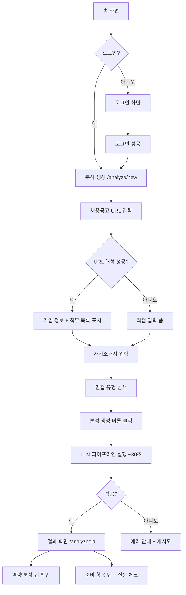
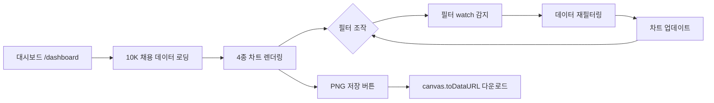

# 🎨 PathFinder AI — UI/UX 디자인 명세서

> **버전**: v1.0  
> **작성일**: 2026-06-26  
> **작성자**: 팀 T08 (전호준, 황인서)

---

## 목차

1. [디자인 시스템](#1-디자인-시스템)
2. [화면별 디자인 명세](#2-화면별-디자인-명세)
3. [컴포넌트 설계](#3-컴포넌트-설계)
4. [사용자 플로우](#4-사용자-플로우)
5. [반응형 디자인](#5-반응형-디자인)
6. [접근성 기준](#6-접근성-기준)

---

## 1. 디자인 시스템

### 1.1 색상 팔레트

PathFinder AI는 신뢰감과 전문성을 전달하는 색상 체계를 사용합니다.

| 역할 | 색상명 | CSS 변수 | 용도 |
|------|--------|----------|------|
| Primary | 인디고 블루 | `--color-primary` | CTA 버튼, 핵심 강조 |
| Success | 에메랄드 그린 | `--color-success` | `strength` 역량 배지, 완료 상태 |
| Warning | 앰버 옐로우 | `--color-warning` | `articulate` 역량 배지, 경고 |
| Danger | 코랄 레드 | `--color-danger` | `study` 역량 배지, 에러 |
| Neutral | 슬레이트 그레이 | `--color-neutral` | `insufficient_data` 배지, 비활성 |
| Background | 오프 화이트 | `--color-bg` | 페이지 배경 |
| Surface | 순백색 | `--color-surface` | 카드, 패널 배경 |
| Text | 차콜 | `--color-text` | 본문 텍스트 |
| Text Muted | 미디엄 그레이 | `--color-text-muted` | 보조 텍스트, 메타 정보 |
| Border | 라이트 그레이 | `--color-border` | 카드 테두리, 구분선 |

### 1.2 타이포그래피

| 분류 | 폰트 | 크기 | 굵기 |
|------|------|------|------|
| 헤딩 H1 | 시스템 sans-serif | 2rem | 700 |
| 헤딩 H2 | 시스템 sans-serif | 1.5rem | 600 |
| 헤딩 H3 | 시스템 sans-serif | 1.25rem | 600 |
| 본문 | 시스템 sans-serif | 1rem | 400 |
| 보조 | 시스템 sans-serif | 0.875rem | 400 |
| 라벨/배지 | 시스템 sans-serif | 0.75rem | 500 |

### 1.3 간격 시스템

4px 베이스 그리드를 사용합니다.

| 토큰 | 값 | 용도 |
|------|-----|------|
| `--space-xs` | 4px | 아이콘 내부 여백 |
| `--space-sm` | 8px | 인라인 요소 간격 |
| `--space-md` | 16px | 컴포넌트 내부 패딩 |
| `--space-lg` | 24px | 섹션 간격 |
| `--space-xl` | 32px | 페이지 섹션 상하 여백 |
| `--space-2xl` | 48px | 페이지 최상단/최하단 여백 |

### 1.4 Border Radius

| 토큰 | 값 | 용도 |
|------|-----|------|
| `--radius-sm` | 4px | 배지, 태그 |
| `--radius-md` | 8px | 버튼, 입력 필드 |
| `--radius-lg` | 12px | 카드 |
| `--radius-xl` | 16px | 모달, 대형 패널 |
| `--radius-full` | 9999px | 원형 아바타, 토글 |

### 1.5 그림자

| 토큰 | 값 | 용도 |
|------|-----|------|
| `--shadow-sm` | `0 1px 3px rgba(0,0,0,0.12)` | 카드 기본 |
| `--shadow-md` | `0 4px 12px rgba(0,0,0,0.15)` | 카드 호버 |
| `--shadow-lg` | `0 8px 24px rgba(0,0,0,0.18)` | 모달, 드롭다운 |

---

## 2. 화면별 디자인 명세

### 2.1 홈 화면 (`/`)

**목적**: 서비스 소개 및 사용자 진입점

**비로그인 상태:**
- 영역 1 (Hero): 서비스 슬로건 + 주요 기능 설명 + "시작하기" CTA 버튼
- 영역 2 (Feature Cards): 3개 핵심 기능 카드 (AI 로드맵 / 역량 분석 / 대시보드)
- 영역 3 (Footer): 팀 정보

**로그인 상태:**
- 영역 1: 환영 메시지 + "분석 시작" 메인 CTA
- 영역 2: 빠른 접근 카드 (분석하기 / 히스토리 / 대시보드 / 커뮤니티)
- 영역 3: 최근 분석 요약 (있는 경우)

**인터랙션:**
- 로그인/비로그인 상태에 따라 Pinia auth store 감시 → 조건부 렌더링

---

### 2.2 로그인/회원가입 (`/login`, `/signup`)

**레이아웃**: 중앙 정렬 카드 (최대 너비 400px)

**로그인 폼:**
- 이메일 입력 (type="email", autocomplete="email")
- 비밀번호 입력 (type="password", autocomplete="current-password")
- 로그인 버튼 (Primary 색상)
- 회원가입 링크

**회원가입 폼:**
- 이메일 입력
- 비밀번호 입력 + 비밀번호 확인
- 이용약관 동의 체크박스 (필수)
- 개인정보처리방침 동의 체크박스 (필수)
- 가입 버튼

**유효성 검사:**
- 실시간 이메일 형식 검사
- 비밀번호 일치 여부 확인
- 필수 동의 항목 미체크 시 버튼 비활성화

---

### 2.3 프로필 관리 (`/profile`)

**레이아웃**: 2컬럼 (좌: 기본정보, 우: 상세 이력)

**기본 정보 섹션:**
- 이름 (text input)
- 전공 (text input)
- 학력 (text input, 예: "컴퓨터공학과 학사 졸업")

**경력 섹션 (반복 입력):**
- 각 경력: 회사명 / 직무명 / 담당 업무 및 성과 (textarea)
- 우측 상단: `[+ 경력 추가]` 버튼, 각 항목 우측 `[삭제]` 버튼

**프로젝트 섹션 (반복 입력):**
- 각 프로젝트: 프로젝트명 / 역할 / 기술스택 / 설명 / 결과
- `[+ 프로젝트 추가]` 버튼

**자격증 섹션 (반복 입력):**
- 자격증명 (text input)
- `[+ 자격증 추가]` 버튼

**수상내역 섹션 (반복 입력):**
- 수상명 + 수상 내용
- `[+ 수상 추가]` 버튼

**저장 버튼:**
- 페이지 하단 고정 또는 섹션별
- 저장 성공 시 토스트 알림

---

### 2.4 분석 생성 (`/analyze/new`)

**레이아웃**: 단계별 스텝 UI (Step 1 → Step 2 → Step 3 → 생성 중)

#### Step 1: 채용공고 입력

**방법 A — URL 입력:**
```
[채용공고 URL 입력창] [URL로 찾기 버튼]
  ↓ 성공 시
[회사명] [직무 목록] 자동 표시
```

**방법 B — 직접 입력 (fallback):**
```
회사명 [text input]
직무명 [text input]
담당 업무 [textarea]
자격 요건 [textarea]
우대 사항 [textarea]
```

**상태 표시:**
- URL 해석 로딩: 스피너
- 지원 기업: 초록색 체크 + 기업명
- 미지원 기업: 주황색 경고 + "직접 입력으로 전환" 버튼

#### Step 2: 자기소개서 입력

- Q&A 항목별 입력 (최소 1개)
- 각 항목: 질문 제목 + 답변 textarea
- `[+ 항목 추가]` / 항목 삭제 버튼
- 또는 전체 자기소개서 텍스트 일괄 붙여넣기 옵션

#### Step 3: 면접 유형 선택

- 체크박스 그룹: 기술면접 / 임원면접 / PT면접 / 기타
- "기타" 선택 시 상세 입력 textfield 표시
- 최소 1개 선택 필수

#### 생성 중 화면:

```
🧭 AI가 분석 중입니다...
[진행 중 애니메이션 / 스피너]
약 20~60초 소요됩니다.
```

---

### 2.5 분석 결과 (`/analyze/:id`)

**레이아웃**: 헤더 + 2컬럼 (좌: 탭 컨텐츠, 우: 사이드바)

**헤더 영역:**
- 회사명, 직무, 면접 유형, 생성 일시

**탭 1 — 역량 분석:**

| 역량 키워드 | 상태 배지 | radar/job 스코어 | 다음 행동 |
|------------|----------|-----------------|----------|
| FastAPI | 🟢 어필 가능 | 내 역량 75 / 기업 요구 85 | 성능 수치 기반 답변 정리 |
| Kafka | 🔴 학습 필요 | 내 역량 10 / 기업 요구 80 | 메시지 큐 기초 학습 |

배지 색상:
- `strength`: `var(--color-success)` 배경
- `articulate`: `var(--color-warning)` 배경
- `study`: `var(--color-danger)` 배경
- `insufficient_data`: `var(--color-neutral)` 배경

**탭 2 — 준비 항목 (Timeline):**

각 담당업무 카드:
```
[우선순위 번호] 담당업무 키워드
  경험 매칭: direct / related / none (아이콘 + 텍스트)
  ├── 세부 지식 1 [preparation_type 배지]
  │     예상 질문:
  │     □ [질문 텍스트] (체크 가능)
  │       꼬리질문: [...]
  └── 세부 지식 2...
```

**진행률 표시:**
- 체크된 질문 수 / 전체 질문 수
- 프로그레스 바 (인라인 CSS 너비)

**사이드바:**
- "제출한 자기소개서 보기" 버튼 → 모달 오픈
- 분석 메타 정보 (생성일, 상태)

---

### 2.6 대시보드 (`/dashboard`)

**레이아웃**: 상단 필터 영역 + 2×2 차트 그리드

**필터 영역:**
```
[산업군 드롭다운] [경력 범위 슬라이더 0~10년] [기업명 검색창] [초기화 버튼]
```

**차트 레이아웃:**
```
┌──────────────────────┬──────────────────────┐
│  산업별 연봉 vs 지원자  │   직급별 지원자 분포    │
│  (Bar + Line 혼합)    │   (Doughnut 차트)     │
├──────────────────────┼──────────────────────┤
│  경력 요구조건 트렌드   │   급여 분포도          │
│  (Line 차트)          │   (영역 차트)          │
└──────────────────────┴──────────────────────┘
```

각 차트 우측 상단: `[PNG 저장]` 버튼

---

### 2.7 커뮤니티 (`/community`)

**레이아웃**: 좌: 후기 목록, 우: 필터 패널 (또는 상단 필터)

**후기 목록 카드:**
```
[회사명] [직무] [면접 유형 태그]
제목 텍스트
[날짜] [난이도: ★★★☆☆] [합격 여부 배지]
본문 미리보기 (2줄 말줄임)
```

**후기 작성 폼:**
- 회사명, 직무명, 면접 유형 (필수)
- 면접 날짜 (date picker)
- 난이도 (1-5 별점 또는 라디오)
- 합격 여부 (드롭다운)
- 면접 질문 (textarea)
- 후기 본문 (textarea, 필수)
- 준비 팁 (textarea)

**후기 상세:**
- 전체 정보 표시
- 본인 후기: `[수정]` `[삭제]` 버튼 표시

---

## 3. 컴포넌트 설계

### 3.1 공통 컴포넌트

| 컴포넌트 | 위치 | 책임 |
|---------|------|------|
| `NavBar.vue` | `components/` | 상단 내비게이션, 로그인/로그아웃 상태 |
| `LoadingSpinner.vue` | `components/` | 로딩 중 표시 |
| `ToastNotification.vue` | `components/` | 성공/에러 알림 |
| `ConfirmModal.vue` | `components/` | 삭제 확인 모달 |

### 3.2 분석 결과 컴포넌트

| 컴포넌트 | 위치 | 책임 |
|---------|------|------|
| `CompetencyMap.vue` | `components/result/` | 역량 배지 + 스코어 표시 |
| `TimelineCard.vue` | `components/result/` | 담당업무 카드 + subtopics |
| `QuestionChecklist.vue` | `components/result/` | 예상 질문 체크리스트 |
| `CoverLetterModal.vue` | `components/result/` | 자기소개서 원문 모달 |
| `ProgressBar.vue` | `components/result/` | 준비 진행률 |

### 3.3 프로필 컴포넌트

| 컴포넌트 | 위치 | 책임 |
|---------|------|------|
| `CareerList.vue` | `components/profile/` | 경력 반복 입력 |
| `ProjectList.vue` | `components/profile/` | 프로젝트 반복 입력 |
| `AwardList.vue` | `components/profile/` | 수상 반복 입력 |
| `CertificateList.vue` | `components/profile/` | 자격증 반복 입력 |

### 3.4 Pinia Store

| Store | 파일 | 상태 |
|-------|------|------|
| `useAuthStore` | `stores/auth.js` | `user`, `accessToken`, `refreshToken`, 로그인/로그아웃/갱신 액션 |

### 3.5 Composables

| Composable | 파일 | 책임 |
|-----------|------|------|
| `useRoadmapProgress` | `composables/useRoadmapProgress.js` | 분석 결과 질문 체크 상태 관리, 진행률 계산 |
| `useJobsData` | `composables/useJobsData.js` | 대시보드 채용 데이터 로딩 및 필터링 |

---

## 4. 사용자 플로우

### 4.1 핵심 플로우: AI 면접 준비



### 4.2 플로우: 대시보드



---

## 5. 반응형 디자인

### 5.1 브레이크포인트

| 이름 | 최소 너비 | 대상 기기 |
|------|----------|-----------|
| `mobile` | 320px | 스마트폰 세로 |
| `tablet` | 768px | 태블릿, 스마트폰 가로 |
| `desktop` | 1024px | 데스크톱, 랩톱 |
| `wide` | 1280px | 와이드 모니터 |

### 5.2 레이아웃 변화

| 화면 | Desktop | Tablet | Mobile |
|------|---------|--------|--------|
| 분석 결과 | 탭 컨텐츠 + 사이드바 2컬럼 | 탭 컨텐츠 + 사이드바 스택 | 탭 컨텐츠 단일 컬럼 |
| 대시보드 차트 | 2×2 그리드 | 1×4 세로 스택 | 1×4 세로 스택 |
| 프로필 | 2컬럼 | 단일 컬럼 | 단일 컬럼 |
| 커뮤니티 | 목록 + 필터 사이드바 | 목록 상단 필터 | 목록 단일 컬럼 |

---

## 6. 접근성 기준

### 6.1 인터랙티브 요소

- 모든 버튼과 입력 필드에 고유한 `id` 속성 부여 (Playwright 테스트용)
- `aria-label` 속성으로 버튼 목적 명시 (아이콘 전용 버튼)
- 키보드 포커스 가능한 요소에 `tabindex` 순서 설정

### 6.2 색상 접근성

- 역량 배지는 색상뿐 아니라 텍스트 레이블도 함께 표시 (색약 사용자 배려)
  - `strength`: 🟢 + "어필 가능"
  - `articulate`: 🟡 + "답변 정리"
  - `study`: 🔴 + "학습 필요"
  - `insufficient_data`: ⚪ + "판단 보류"

### 6.3 상태 피드백

- 로딩 상태: 스피너 + 텍스트 ("분석 중...")
- 성공 상태: 초록색 토스트 알림
- 에러 상태: 빨간색 토스트 알림 + 재시도 방법 안내
- 빈 상태: 적절한 Empty State UI (아이콘 + 안내 문구 + CTA 버튼)

### 6.4 폼 유효성

- 에러 메시지는 해당 입력 필드 아래에 인라인으로 표시
- 필수 항목 표시 (`*` 또는 "필수" 레이블)
- 제출 전 유효성 검사 통과 후 버튼 활성화
