# PathFinder GraphRAG 설계안  
## `jobs_careers.jsonl` 기반 재정리

> 작성일: 2026-06-23  
> 기준 파일: `jobs_careers.jsonl`  
> 핵심 결론: **현재 파일은 “상세 채용공고 DB”가 아니라 “기업·산업·직무 시장 통계 DB”에 가깝다.** 따라서 처음부터 무거운 Microsoft GraphRAG 전체 파이프라인을 붙이기보다, **Neo4j 기반 경량 GraphRAG + 향후 JD/스킬 컬럼 확장** 구조가 가장 현실적이다.

---

## 1. 한눈에 보는 결론

| 판단 항목 | 결론 |
|---|---|
| GraphRAG 도입 여부 | **도입 권장**. 단, 현재 파일만으로는 `GraphRAG Lite`부터 시작 |
| 현재 데이터의 강점 | 기업·산업·직무·연봉·경력·지원자 수 기반 시장 분석 |
| 현재 데이터의 약점 | JD 본문, 스킬, 자격요건, 우대사항, 업무내용이 없음 |
| 우선 구현 | `Company → JobPosting → Industry/Role/SalaryBand/ExperienceBand` 그래프 |
| 기존 기능과의 연결 | 채용공고 추천, 경력 수준 비교, 경쟁도 분석, 시장 포지셔닝에 즉시 활용 |
| 확장 후 핵심 기능 | 역량 Gap 분석, 4주 플랜, 면접 질문 생성의 정확도 개선 |
| 추천 스택 | **Neo4j + BGE-M3/Solar Embedding + FastAPI GraphRAG Layer** |

---

## 2. 실제 파일 데이터 프로파일

### 2.1 데이터 규모

| 지표 | 값 |
|---|---:|
| 전체 레코드 수 | 10,000 |
| 기업 수 | 45 |
| 산업 수 | 16 |
| 원본 직무명 수 | 288 |
| 정규화 직무군 수 | 48 |
| 평균 연봉 | 9.9천만 |
| 중앙값 연봉 | 9.8천만 |
| 연봉 범위 | 4.8천만 ~ 1.84억 |
| 평균 요구 경력 | 5.49년 |
| 평균 지원자 수 | 117.7명 |

### 2.2 실제 컬럼 구조

| 컬럼 | 타입 | 결측 | 고유값 | 샘플 | GraphRAG 활용 |
| --- | --- | --- | --- | --- | --- |
| job_title | object | 0 | 288 | 리드 퍼포먼스 마케터 | Role/JobPosting 식별, 직무 정규화 후보 |
| industry | object | 0 | 16 | 콘텐츠 | Industry 노드, 산업별 시장 비교 |
| company_name | object | 0 | 45 | 네이버웹툰 | Company 노드, 기업별 공고 집계 |
| annual_salary_krw | int64 | 0 | 9,998 | 7.8천만 | SalaryBand 속성, 보상 기반 추천 |
| required_experience_years | int64 | 0 | 13 | 4 | ExperienceLevel 속성, 경력 적합도 |
| applicant_count | int64 | 0 | 503 | 202 | CompetitionSignal 속성, 경쟁도·인기도 |

**관찰:** 모든 컬럼에 결측이 없어서 그래프 적재 자체는 쉽다. 다만 `required_skills`, `responsibilities`, `qualifications`, `description` 같은 RAG 핵심 텍스트가 없기 때문에, 현재 상태에서는 “문서 검색형 RAG”보다 **시장·직무 그래프 분석**에 더 적합하다.

---

## 3. 데이터 시각화

### 3.1 산업별 공고 수

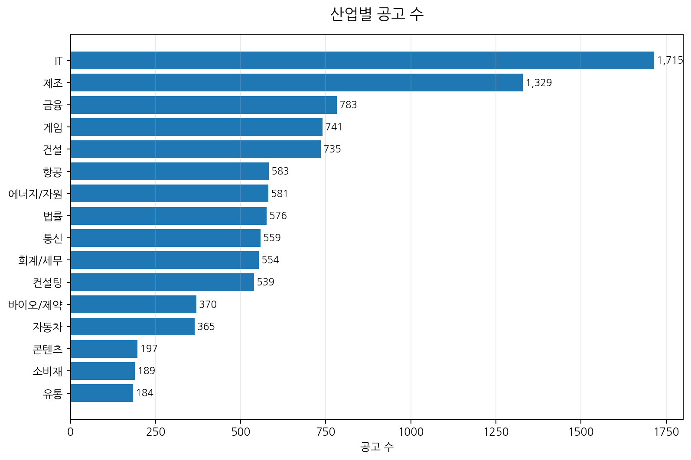

### 3.2 공고 수 상위 기업

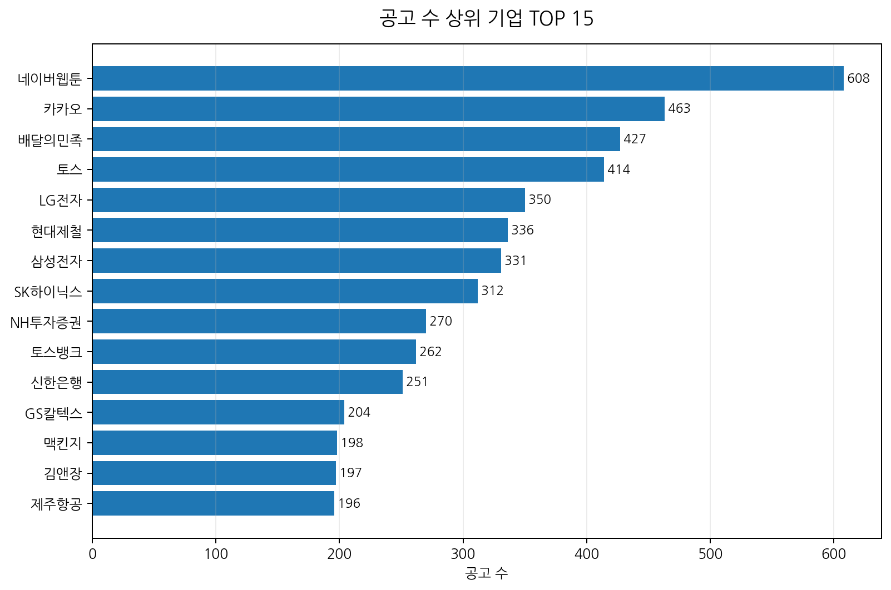

### 3.3 산업별 평균 연봉

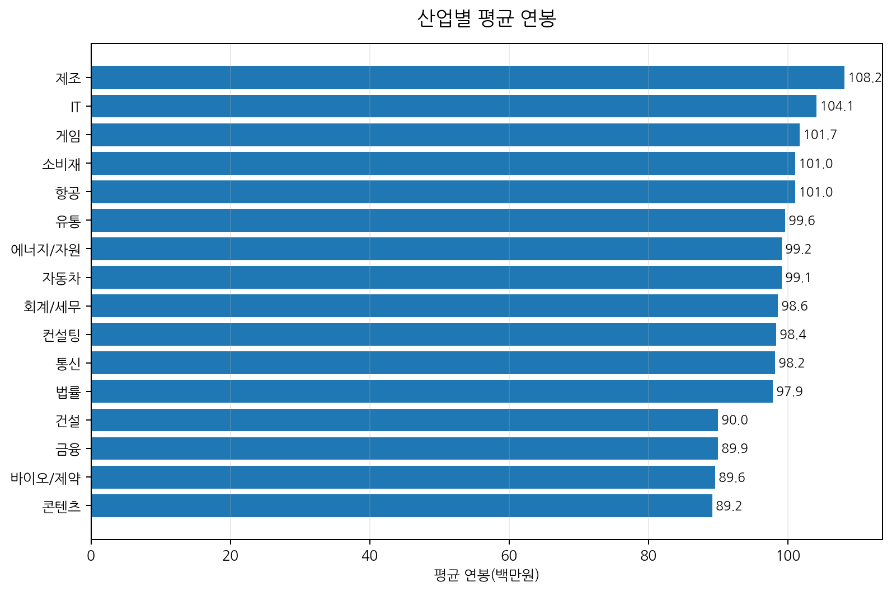

### 3.4 요구 경력 구간 분포

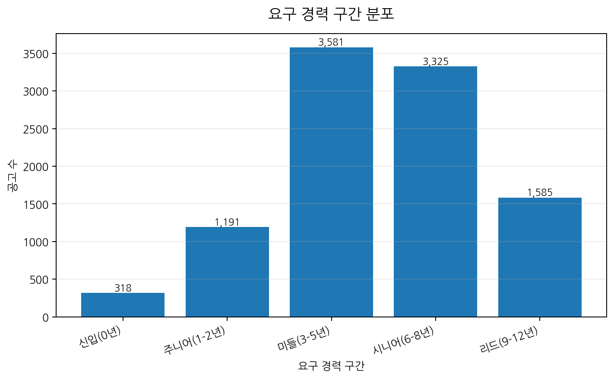

### 3.5 요구 경력 vs 연봉

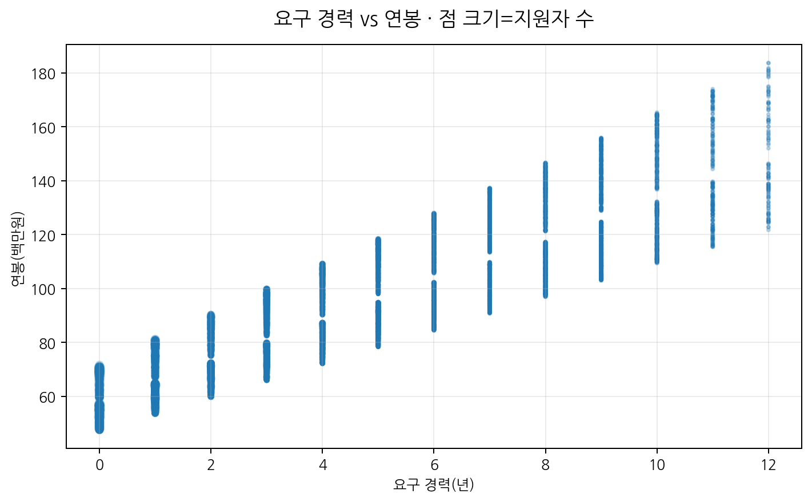

**해석 포인트**

| 관찰 | 의미 |
|---|---|
| IT 공고가 1,715건으로 최다 | PathFinder 초기 데모는 IT/개발 직군 중심으로 설계하는 것이 자연스럽다 |
| 평균 연봉과 요구 경력의 상관계수 `0.86` | 연봉은 경력 요구와 강하게 연결된다 |
| 연봉과 지원자 수의 상관계수 `-0.73` | 고연봉·고경력 공고일수록 지원자 수가 줄어드는 패턴이 있다 |
| 지원자 수와 요구 경력의 상관계수 `-0.86` | 신입/주니어 공고의 경쟁도가 높을 가능성이 크다 |

---

## 4. 산업·기업·직무 상위 분포

### 4.1 산업별 분포

| 산업 | 공고 수 | 비중 |
| --- | --- | --- |
| IT | 1,715 | 17.2% |
| 제조 | 1,329 | 13.3% |
| 금융 | 783 | 7.8% |
| 게임 | 741 | 7.4% |
| 건설 | 735 | 7.3% |
| 항공 | 583 | 5.8% |
| 에너지/자원 | 581 | 5.8% |
| 법률 | 576 | 5.8% |
| 통신 | 559 | 5.6% |
| 회계/세무 | 554 | 5.5% |
| 컨설팅 | 539 | 5.4% |
| 바이오/제약 | 370 | 3.7% |
| 자동차 | 365 | 3.6% |
| 콘텐츠 | 197 | 2.0% |
| 소비재 | 189 | 1.9% |
| 유통 | 184 | 1.8% |

### 4.2 공고 수 상위 기업 TOP 15

| 기업 | 공고 수 | 비중 |
| --- | --- | --- |
| 네이버웹툰 | 608 | 6.1% |
| 카카오 | 463 | 4.6% |
| 배달의민족 | 427 | 4.3% |
| 토스 | 414 | 4.1% |
| LG전자 | 350 | 3.5% |
| 현대제철 | 336 | 3.4% |
| 삼성전자 | 331 | 3.3% |
| SK하이닉스 | 312 | 3.1% |
| NH투자증권 | 270 | 2.7% |
| 토스뱅크 | 262 | 2.6% |
| 신한은행 | 251 | 2.5% |
| GS칼텍스 | 204 | 2.0% |
| 맥킨지 | 198 | 2.0% |
| 김앤장 | 197 | 2.0% |
| 제주항공 | 196 | 2.0% |

### 4.3 평균 연봉 상위 산업 TOP 10

| 산업 | 공고 수 | 평균 연봉 | 평균 요구 경력 | 평균 지원자 수 |
| --- | --- | --- | --- | --- |
| 제조 | 1,329 | 1.08억 | 5.7년 | 110.3명 |
| IT | 1,715 | 1.04억 | 5.5년 | 116.7명 |
| 게임 | 741 | 1.02억 | 5.5년 | 133.7명 |
| 소비재 | 189 | 1.01억 | 5.7년 | 107.0명 |
| 항공 | 583 | 1.01억 | 5.5년 | 81.7명 |
| 유통 | 184 | 10.0천만 | 5.5년 | 116.0명 |
| 에너지/자원 | 581 | 9.9천만 | 5.5년 | 119.9명 |
| 자동차 | 365 | 9.9천만 | 5.5년 | 122.9명 |
| 회계/세무 | 554 | 9.9천만 | 5.4년 | 125.3명 |
| 컨설팅 | 539 | 9.8천만 | 5.5년 | 118.5명 |

### 4.4 정규화 직무군 TOP 12

| 정규화 직무군 | 공고 수 | 비중 |
| --- | --- | --- |
| 현장 소장 | 806 | 8.1% |
| 구매/조달 | 433 | 4.3% |
| 반도체 공정 엔지니어 | 412 | 4.1% |
| 품질 보증 엔지니어 | 396 | 4.0% |
| 공정개발 | 386 | 3.9% |
| 운항관리사 | 360 | 3.6% |
| 항공기 조종사 | 358 | 3.6% |
| DBA | 290 | 2.9% |
| 모바일 앱 개발자 (Android) | 283 | 2.8% |
| 펀드 매니저 | 280 | 2.8% |
| 경영 컨설턴트 | 280 | 2.8% |
| 프로덕트 매니저(PM) | 275 | 2.8% |

---

## 5. GraphRAG 적용 판단

### 5.1 현재 파일만으로 가능한 것과 어려운 것

| 기능 | 현재 파일만으로 가능? | 이유 |
|---|---:|---|
| 기업별 채용 규모 분석 | 가능 | `company_name`, 공고 수 존재 |
| 산업별 연봉/경력/경쟁도 분석 | 가능 | `industry`, `annual_salary_krw`, `required_experience_years`, `applicant_count` 존재 |
| 직무군별 시장 포지셔닝 | 가능 | `job_title`에서 seniority/role_base 추출 가능 |
| 사용자 경력 수준 대비 공고 추천 | 부분 가능 | 요구 경력과 연봉은 있으나 스킬 매칭은 없음 |
| 역량 Gap 분석 | 약함 | 스킬·자격요건·업무내용 컬럼 부재 |
| 4주 준비 플랜 | 약함 | 부족 역량을 계산할 근거가 부족 |
| 면접 질문 생성 | 약함 | 기술스택·업무내용·요구역량이 없음 |
| JD 근거 기반 설명 | 불가 | 원문 공고/description/source_url 없음 |

### 5.2 최종 판단

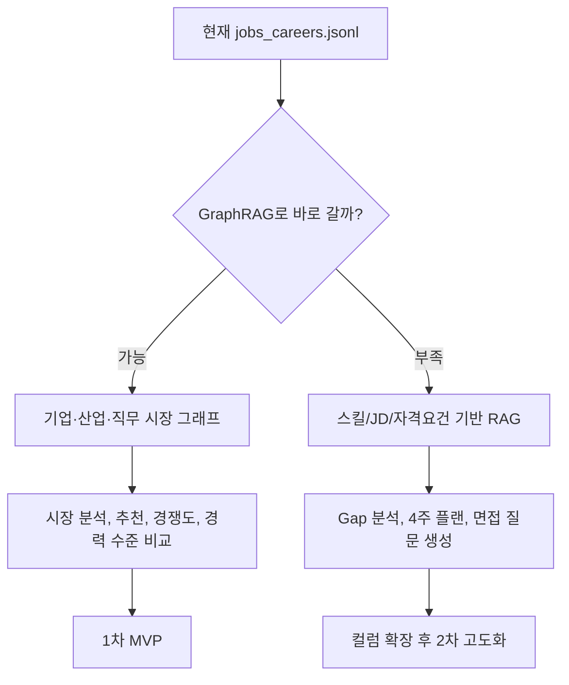

**정리:**  
현재 데이터는 GraphRAG의 “Graph”에는 잘 맞지만, “RAG”에는 아직 텍스트 근거가 부족하다. 따라서 1단계는 **Graph 기반 추천/분석 엔진**, 2단계는 **JD/스킬 확장 후 GraphRAG**로 가는 구성이 맞다.

---

## 6. 현재 데이터 기준 그래프 스키마

### 6.1 1차 MVP 그래프

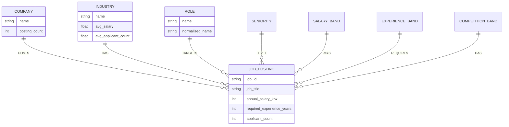

### 6.2 노드/엣지 설계

| 노드 | 생성 기준 | 현재 파일에서 가능 여부 | 용도 |
|---|---|---:|---|
| `Company` | `company_name` | 가능 | 기업별 공고 규모, 기업 추천 |
| `Industry` | `industry` | 가능 | 산업군 비교, 산업별 연봉/경쟁도 |
| `JobPosting` | row 단위 ID 생성 | 가능 | 개별 공고 노드 |
| `Role` | `job_title` 정규화 | 가능 | 직무군 검색/추천 |
| `Seniority` | 직무명 접두어 + 요구 경력 | 가능 | 주니어/시니어/리드 분류 |
| `SalaryBand` | 연봉 구간화 | 가능 | 보상 기준 추천 |
| `ExperienceBand` | 경력 구간화 | 가능 | 사용자 경력 수준 매칭 |
| `CompetitionBand` | 지원자 수 구간화 | 가능 | 경쟁도 분석 |

| 엣지 | From → To | 의미 |
|---|---|---|
| `POSTS` | `Company → JobPosting` | 기업이 공고를 보유 |
| `BELONGS_TO` | `JobPosting → Industry` | 공고의 산업군 |
| `TARGETS_ROLE` | `JobPosting → Role` | 공고의 직무군 |
| `HAS_SENIORITY` | `JobPosting → Seniority` | 직무 레벨 |
| `HAS_SALARY_BAND` | `JobPosting → SalaryBand` | 연봉 구간 |
| `REQUIRES_EXPERIENCE` | `JobPosting → ExperienceBand` | 요구 경력 구간 |
| `HAS_COMPETITION` | `JobPosting → CompetitionBand` | 경쟁도 구간 |

---

## 7. 확장 후 GraphRAG 스키마

현재 파일을 진짜 PathFinder용 DB로 만들려면 아래 컬럼을 추가하는 것이 좋다.

### 7.1 확장 컬럼 우선순위

| 우선순위 | 컬럼 | 타입 | 이유 |
|---:|---|---|---|
| 1 | `required_skills` | list[string] | Gap 분석의 핵심 |
| 1 | `preferred_skills` | list[string] | 차별화 포인트 분석 |
| 1 | `responsibilities` | list[string] or text | 실제 업무 기반 면접 질문 생성 |
| 1 | `qualifications` | list[string] or text | 필수 자격요건 비교 |
| 1 | `description` | text | RAG 검색 근거 |
| 2 | `source_url` | string | 원문 추적 및 신뢰도 |
| 2 | `employment_type` | string | 인턴/정규직/계약직 필터 |
| 2 | `location` | string | 지역 기반 추천 |
| 2 | `deadline` | date | 마감 임박 공고 우선순위 |
| 2 | `job_category` | string | 백엔드/프론트/데이터/인프라 등 표준 분류 |
| 3 | `competency_tags` | list[string] | 문제해결, 협업, 대용량처리 등 역량 태그 |
| 3 | `interview_topics` | list[string] | 면접 질문 생성 품질 개선 |
| 3 | `difficulty_level` | int/string | 4주 플랜 난이도 조절 |
| 3 | `skill_weight_map` | object | 스킬별 중요도 가중치 |

### 7.2 확장 후 그래프

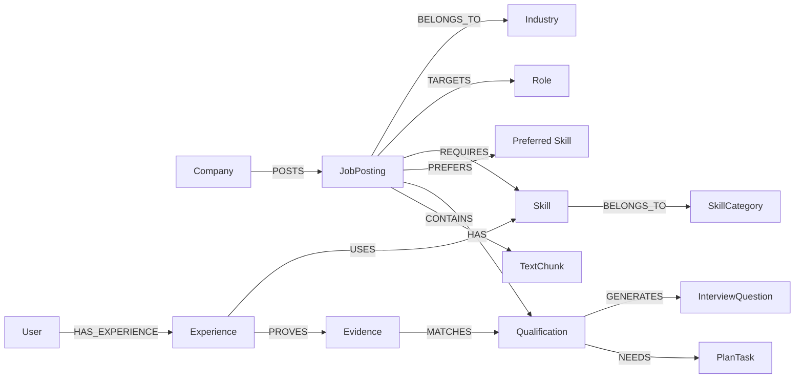

---

## 8. 기존 기능과의 연동 방식

| 기존 기능 | 현재 데이터 기반 | 확장 후 GraphRAG 기반 |
|---|---|---|
| 채용공고 분석 | 산업, 기업, 경력, 연봉, 경쟁도 요약 | JD 본문, 스킬, 업무, 자격요건까지 구조화 |
| 사용자 경험 비교 | 경력 연차와 희망 산업/직무 비교 | 경험의 스킬·성과·증거를 공고 요구사항과 연결 |
| Gap 분석 | 경력 수준 Gap, 시장 경쟁도 Gap | 필수 스킬 Gap, 우대사항 Gap, 경험 증거 Gap |
| 4주 플랜 | 경력/직무군 기준 일반 플랜 | 부족 스킬과 면접 주제 기반 개인화 플랜 |
| 면접 질문 생성 | 직무군·산업 기반 일반 질문 | JD 요구사항 + 사용자 약점 기반 질문 |
| 추천 공고 | 경력·연봉·산업 기반 추천 | 스킬·경험·선호·경쟁도까지 반영한 추천 |

### 8.1 추천 점수 예시

```text
fit_score =
  0.30 * experience_match
+ 0.20 * role_match
+ 0.15 * industry_preference
+ 0.15 * salary_preference
+ 0.10 * competition_inverse
+ 0.10 * skill_match  # 확장 후 활성화
```

현재 파일에서는 `skill_match`를 계산할 수 없으므로 0 또는 비활성으로 두고, `experience_match`, `role_match`, `industry_preference`, `salary_preference`, `competition_inverse` 중심으로 시작한다.

---

## 9. 추천 아키텍처

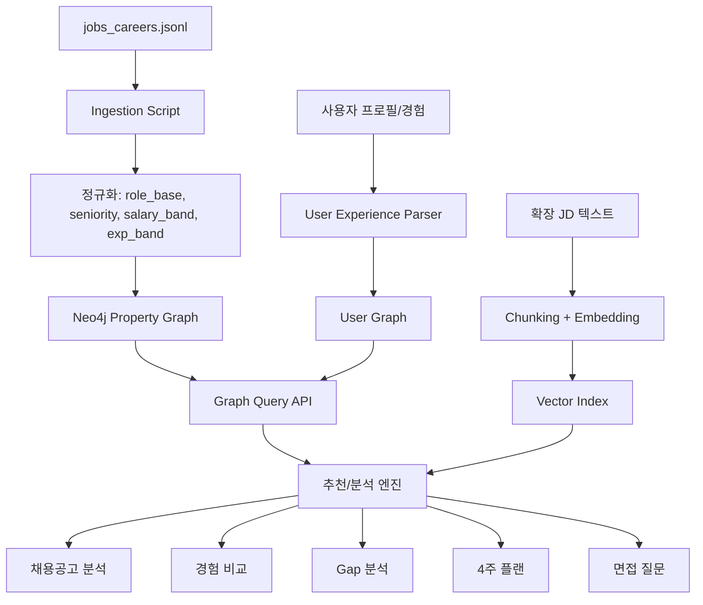

### 9.1 왜 Neo4j 중심인가?

| 선택지 | 적합도 | 이유 |
|---|---:|---|
| Neo4j 단독 | 높음 | 현재 데이터는 관계형/그래프형 구조가 명확함 |
| Neo4j + Vector Index | 높음 | 향후 `description`, `responsibilities` 확장 시 바로 RAG 가능 |
| Microsoft GraphRAG 전체 파이프라인 | 중간 | 대규모 비정형 문서에는 좋지만 현재 JSONL에는 과함 |
| Weaviate 중심 | 중간 | 하이브리드 검색은 좋지만 깊은 그래프 탐색은 Neo4j보다 약함 |
| Milvus + Neo4j | 중간~높음 | 대규모 벡터 검색으로 커질 때 적합. 초기 MVP에는 무거움 |

---

## 10. GraphRAG 적용 로드맵

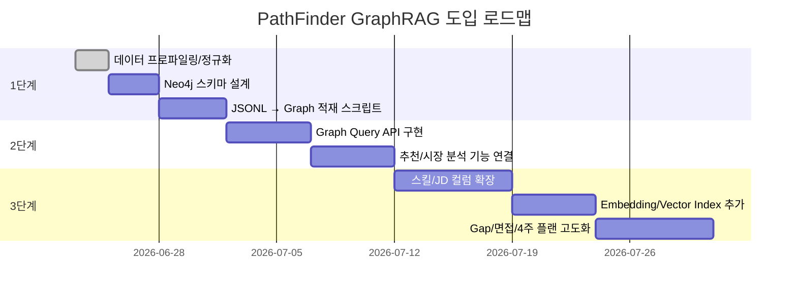

### 단계별 산출물

| 단계 | 산출물 | 검증 기준 |
|---|---|---|
| 1단계 | Neo4j 그래프, 적재 스크립트 | 10,000건 전량 upsert |
| 2단계 | 시장 분석 API, 추천 API | 산업/기업/직무별 집계 응답 |
| 3단계 | 확장 스키마, 벡터 인덱스 | JD 기반 근거 검색 가능 |
| 4단계 | Gap·면접·플랜 고도화 | 사용자 경험과 요구역량 연결 |

---

## 11. API 설계 초안

| 메서드 | 엔드포인트 | 용도 |
|---|---|---|
| `POST` | `/api/graphrag/index/jobs` | JSONL 공고 적재 |
| `GET` | `/api/market/industries` | 산업별 통계 |
| `GET` | `/api/market/companies` | 기업별 통계 |
| `GET` | `/api/market/roles` | 직무군별 통계 |
| `POST` | `/api/recommend/jobs` | 사용자 조건 기반 공고 추천 |
| `POST` | `/api/analyze/job` | 공고 분석 |
| `POST` | `/api/analyze/gap` | Gap 분석 |
| `POST` | `/api/plan/4weeks` | 4주 플랜 생성 |
| `POST` | `/api/interview/questions` | 면접 질문 생성 |

---

## 12. Cypher 질의 예시

### 12.1 산업별 평균 연봉

```cypher
MATCH (j:JobPosting)-[:BELONGS_TO]->(i:Industry)
RETURN
  i.name AS industry,
  count(j) AS posting_count,
  avg(j.annual_salary_krw) AS avg_salary
ORDER BY avg_salary DESC;
```

### 12.2 사용자 경력에 맞는 공고 추천

```cypher
MATCH (j:JobPosting)-[:TARGETS_ROLE]->(r:Role)
WHERE r.name CONTAINS $target_role
  AND abs(j.required_experience_years - $user_years) <= 2
RETURN
  j.job_title AS title,
  j.annual_salary_krw AS salary,
  j.required_experience_years AS required_years,
  j.applicant_count AS applicants
ORDER BY
  abs(j.required_experience_years - $user_years) ASC,
  j.annual_salary_krw DESC
LIMIT 20;
```

### 12.3 확장 후 스킬 Gap 분석

```cypher
MATCH (j:JobPosting {job_id: $job_id})-[:REQUIRES]->(s:Skill)
OPTIONAL MATCH (u:User {user_id: $user_id})-[:HAS_EXPERIENCE]->(:Experience)-[:USES]->(s)
WITH j, s, count(*) AS evidence_count
RETURN
  s.name AS required_skill,
  CASE WHEN evidence_count > 0 THEN "covered" ELSE "gap" END AS status
ORDER BY status DESC;
```

---

## 13. 평가 지표

| 평가 영역 | 지표 | 목표 |
|---|---|---|
| 검색 품질 | Context Precision@k | 관련 근거가 상위에 오는지 |
| 생성 신뢰도 | Faithfulness | 답변이 검색 근거를 벗어나지 않는지 |
| 추천 품질 | 사용자 클릭/저장률 | 추천 공고가 실제로 유용한지 |
| Gap 분석 | 사람 라벨과 일치율 | 부족 역량 판단 정확도 |
| 성능 | p95 응답시간 | 실사용 가능한 속도 |
| 비용 | 요청당 LLM/Embedding 비용 | 운영 가능 비용 유지 |

---

## 14. 최종 권고안

### 바로 할 일

1. `job_title`을 `seniority_label`, `role_base`로 정규화한다.
2. `annual_salary_krw`, `required_experience_years`, `applicant_count`를 구간화한다.
3. Neo4j에 `Company`, `Industry`, `Role`, `JobPosting` 중심 그래프를 먼저 만든다.
4. 기존 서비스의 추천/시장 분석/경력 비교 기능에 Graph Query API를 연결한다.

### 그다음 할 일

1. 기업 DB에 `required_skills`, `responsibilities`, `qualifications`, `description`을 추가한다.
2. JD 본문을 chunking하고 BGE-M3 또는 Solar Embedding으로 임베딩한다.
3. `Requirement`, `Skill`, `Evidence`, `InterviewQuestion`, `PlanTask` 노드를 추가한다.
4. Gap 분석, 4주 플랜, 면접 질문 생성을 GraphRAG 기반으로 교체한다.

### 최종 형태

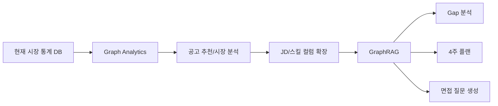

---

## 15. 참고자료

- Microsoft GraphRAG Documentation: https://microsoft.github.io/graphrag/
- Microsoft GraphRAG Query Engine: https://github.com/microsoft/graphrag/blob/main/docs/query/overview.md
- Neo4j GraphRAG Python User Guide: https://neo4j.com/docs/neo4j-graphrag-python/current/user_guide_rag.html
- LlamaIndex Property Graph Index: https://developers.llamaindex.ai/python/framework/module_guides/indexing/lpg_index_guide/
- BGE-M3 Documentation: https://bge-model.com/bge/bge_m3.html
- Neo4j Vector Indexes: https://neo4j.com/docs/cypher-manual/current/indexes/semantic-indexes/vector-indexes/
- Ragas Context Precision: https://docs.ragas.io/en/stable/concepts/metrics/available_metrics/context_precision/
- Ragas Faithfulness: https://docs.ragas.io/en/stable/concepts/metrics/available_metrics/faithfulness/

