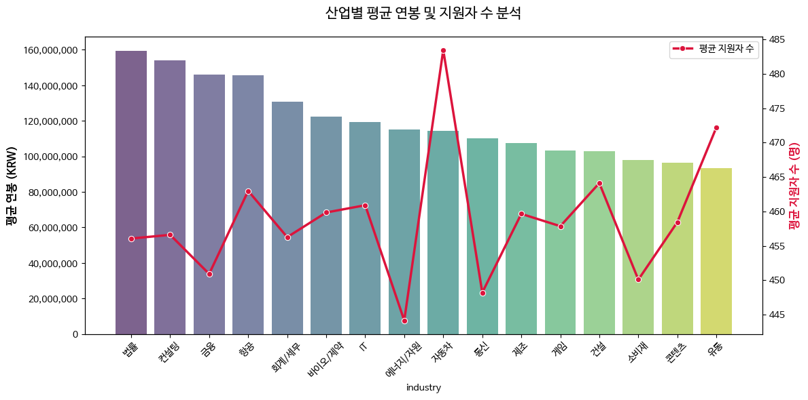

# 채용/커리어 관련 공고 데이터셋 (10,000건)

데이터는 **JSONL(한 줄 = JSON 1개)** 형식으로 제공됩니다.

---

## 배포 파일

- `jobs_careers.jsonl`  
  - 채용 및 커리어 관련 공고 데이터 10,000건(JSONL)

---

## 필드 설명

- `job_title` (string)
    - 공고에 명시된 직무의 공식 명칭입니다.
    - 채용하고자 하는 역할의 핵심 업무를 식별하는 기본 명칭으로 사용됩니다.
- `industry` (string)
    - 해당 기업이 속한 산업군 또는 비즈니스 영역상의 분류입니다.
    - 콘텐츠, 제조, 건설 등 기업의 주력 사업 분야를 나타냅니다.
- `company_name` (string)
    - 채용을 진행하는 기업이나 조직의 공식 이름입니다.
- `annual_salary_krw` (int)
    - 해당 직무에 책정된 원화(KRW) 기준 세전 총 연봉입니다.
    - 보상 수준 및 처우 규모를 파악하는 핵심 지표입니다.
- `required_experience_years` (int)
    - 해당 직무를 수행하기 위해 요구되는 최소 경력 연수입니다.
    - 지원 자격의 충족 여부를 가늠하는 주요 기준으로 활용됩니다.
- `applicant_count` (int)
    - 해당 채용 공고에 지원한 사람의 총 인원수입니다.
    - 경쟁률이나 공고의 주목도를 파악하는 보조 지표로 활용됩니다.

---

## 이 데이터를 어떻게 활용하나요?

### 예시 1) 상관 관계 분석
필드 간 상관 관계가 나타납니다.  

- `annual_salary_krw` <-> `applicant_count`  
  - 산업별 평균 연봉과 지원자 수의 관계를 분석하여  
    어떤 산업이 가장 적은 비용으로 우수한 인재를 효율적으로 끌어모으는지와 업종별 진입 장벽의 크기를 한눈에 파악할 수 있습니다.  

아래처럼 해석할 수 있습니다  

막대(연봉)는 낮은데 선(지원자)이 뾰족하게 높다: "여기가 인기 산업군"  
막대(연봉)는 높은데 선(지원자)이 바닥에 있다: "돈을 줘도 사람 구하기 힘든 전문직 분야"  

각 행(row)은 "채용 공고 1건"을 의미합니다.  

  

### 예시 2) 파운데이션 모델 파인튜닝

본 데이터셋을 활용하여 채용 공고 조건에 따른 예상 지원자 수(`applicant_count`)를 예측하는 **회귀(Regression) 모델**을 구축할 수 있습니다.

실습 모델로는 \*\*BERT(Bidirectional Encoder Representations from Transformers)\*\*를 사용합니다.

  * BERT는 일반적인 언어 구조는 잘 이해하지만, 특정 직무명이나 산업, 연봉 수준에 따른 실제 구직 시장의 지원 행태에 대한 수치적 지식은 부족합니다.
  * 따라서 본 데이터셋의 공고 내용과 실제 지원자 수 간의 관계를 학습시키는 파인튜닝을 통해, 입력된 채용 조건에 최적화된 예상 지원자 수를 산출하도록 모델을 고도화합니다.

---

**1. 가상환경 생성 및 패키지 설치**  

```bash
python3.11 -m venv ./venv
. ./venv/bin/activate

# PyTorch 및 관련 라이브러리 설치
pip install torch==2.9.1 torchvision==0.24.1 torchaudio==2.9.1 --index-url https://download.pytorch.org/whl/cu128

# 데이터 처리 및 학습 가속화 도구 설치
pip install datasets==4.8.4 accelerate==1.13.0 transformers==5.4.0
```

**2. 데이터 전처리 및 학습**  
JSONL 데이터를 모델 학습에 적합한 형태로 변환합니다. 지원자 수 데이터는 로그 변환(`np.log1p`)을 적용하여 학습의 안정성을 높입니다.

```py
import json
import torch
import numpy as np
from datasets import Dataset
from transformers import (
    DataCollatorWithPadding, 
    AutoTokenizer, 
    AutoModelForSequenceClassification, 
    TrainingArguments, 
    Trainer,
    EarlyStoppingCallback
)

# 1) 데이터 전처리 함수 정의
def prepare_data(file_path):
    data = []
    with open(file_path, 'r', encoding='utf-8') as f:
        for line in f:
            item = json.loads(line)
            # 텍스트 피처 구성: 경력과 직무를 전면에 배치하여 중요도 부각
            text = (f"경력: {item['required_experience_years']}년 | 직무: {item['job_title']} | "
                    f"산업: {item['industry']} | 기업: {item['company_name']} | "
                    f"연봉: {item['annual_salary_krw']}원")
            
            # 지원자 수 로그 변환 (회귀 분석 안정성 확보)
            data.append({"text": text, "label": np.log1p(float(item['applicant_count']))})
    
    # 8:2 비율로 학습/검증 데이터 분리
    full_dataset = Dataset.from_list(data).shuffle(seed=42)
    return full_dataset.train_test_split(test_size=0.2)

dataset_dict = prepare_data('jobs_careers.jsonl')

# 2) 토크나이저 및 모델 로드
tokenizer = AutoTokenizer.from_pretrained("bert-base-multilingual-cased")
model = AutoModelForSequenceClassification.from_pretrained("bert-base-multilingual-cased", num_labels=1)

data_collator = DataCollatorWithPadding(tokenizer=tokenizer)

def tokenize_func(examples):
    return tokenizer(examples["text"], truncation=True, max_length=128)

tokenized_datasets = dataset_dict.map(tokenize_func, batched=True, remove_columns=["text"])
tokenized_datasets.set_format(type="torch", columns=["input_ids", "token_type_ids", "attention_mask", "label"])

# 3) 학습 파라미터 설정
args = TrainingArguments(
    output_dir="./jobs-model",
    num_train_epochs=30,             # Early Stopping을 고려하여 넉넉히 설정
    learning_rate=3e-5,
    per_device_train_batch_size=16,
    fp16=True,
    optim="adamw_torch_fused",
    weight_decay=0.01,
    logging_steps=20,
    eval_strategy="steps",
    eval_steps=100,
    save_strategy="steps",
    save_steps=100,
    load_best_model_at_end=True,     # 최적 모델 자동 로드
    metric_for_best_model="loss",
    save_total_limit=2
)

# 4) Trainer 실행 (Early Stopping 추가)
trainer = Trainer(
    model=model,
    args=args,
    train_dataset=tokenized_datasets["train"],
    eval_dataset=tokenized_datasets["test"],
    data_collator=data_collator,
    callbacks=[EarlyStoppingCallback(early_stopping_patience=3)]
)

trainer.train()

# 5) 모델 저장
model.save_pretrained("./applicant-predictor")
tokenizer.save_pretrained("./applicant-predictor")
```

**3. 모델 테스트 및 추론**  
학습된 모델을 로드하여 새로운 채용 시나리오에 대한 지원자 수를 예측합니다. 결과값은 다시 지수 함수(`np.expm1`)를 적용하여 실제 건수 단위로 복원합니다.

```py
from transformers import AutoModelForSequenceClassification, AutoTokenizer
import torch
import numpy as np

path = "./applicant-predictor"
loaded_tokenizer = AutoTokenizer.from_pretrained(path)
loaded_model = AutoModelForSequenceClassification.from_pretrained(path)
loaded_model.eval()

def predict_applicants(title, industry, company, salary, exp):
    # 학습 시와 동일한 텍스트 포맷 사용
    query = f"경력: {exp}년 | 직무: {title} | 산업: {industry} | 기업: {company} | 연봉: {salary}원"
    
    inputs = loaded_tokenizer(query, return_tensors="pt", padding=True, truncation=True)
    
    with torch.no_grad():
        output = loaded_model(**inputs)
        prediction = output.logits.item()
    
    # 로그 역변환을 통한 지원자 수 산출
    return np.expm1(max(0, prediction))

# 테스트 데이터셋
test_jobs = [
    ("주니어 백엔드 엔지니어", "IT", "카카오", 55000000, 1),
    ("수석 데이터 사이언티스트", "IT", "토스", 120000000, 10),
    ("신입 마케터", "콘텐츠", "네이버웹툰", 45000000, 0),
    ("시니어 반도체 공정 엔지니어", "제조", "삼성전자", 95000000, 7),
    ("리드 HRBP", "컨설팅", "BCG", 85000000, 5)
]

print("--- 채용 공고 지원자 수 예측 결과 ---")
for title, industry, company, salary, exp in test_jobs:
    predicted_count = predict_applicants(title, industry, company, salary, exp)
    print(f"[{company} / {title}] ({exp}년차) -> 예측 지원자: {predicted_count:.0f} 명")
```


**추론 결과**  

```text
--- 채용 공고 지원자 수 예측 결과 ---
[카카오 / 주니어 백엔드 엔지니어] (1년차) -> 예측 지원자: 276 명
[토스 / 수석 데이터 사이언티스트] (10년차) -> 예측 지원자: 26 명
[네이버웹툰 / 신입 마케터] (0년차) -> 예측 지원자: 514 명
[삼성전자 / 시니어 반도체 공정 엔지니어] (7년차) -> 예측 지원자: 47 명
[BCG / 리드 HRBP] (5년차) -> 예측 지원자: 114 명
```

#### 모델 추론 결과 평가

학습된 모델의 신뢰성을 확보하기 위해 미학습 데이터(Test Set)를 활용한 정량적 평가와 대형 언어 모델(LLM)을 활용한 정성적 평가를 병행합니다.

##### 1. 정량적 성능 지표 분석 (Quantitative Evaluation)

전체 데이터의 10%(1,000건)를 검증용으로 분리하여 모델이 얼마나 정확하게 예측하는지 수치로 산출합니다. 회귀 모델의 특성을 고려하여 **MAE(평균 절대 오차)**와 **R² Score(결정계수)**를 주요 지표로 활용합니다.  

```bash
pip install scikit-learn==1.8.0
```

```python
import json
import numpy as np
import torch
from datasets import Dataset
from sklearn.metrics import mean_absolute_error, r2_score
from transformers import AutoModelForSequenceClassification, AutoTokenizer

# 1) 데이터 전처리 함수 정의 (훈련 코드와 동일한 포맷 유지)
def prepare_data(file_path):
    data = []
    with open(file_path, 'r', encoding='utf-8') as f:
        for line in f:
            item = json.loads(line)
            text = (f"경력: {item['required_experience_years']}년 | 직무: {item['job_title']} | "
                    f"산업: {item['industry']} | 기업: {item['company_name']} | "
                    f"연봉: {item['annual_salary_krw']}원")
            data.append({"text": text, "label": np.log1p(float(item['applicant_count']))})
    return Dataset.from_list(data)

# 2) 테스트 데이터 준비 (훈련과 동일한 seed=42 셔플 후 20% 분리로 동일한 테스트셋 재현)
full_dataset = prepare_data('jobs_careers.jsonl').shuffle(seed=42)
test_dataset = full_dataset.train_test_split(test_size=0.2)['test']

# 3) 모델 로드 및 추론
path = "./applicant-predictor"
model = AutoModelForSequenceClassification.from_pretrained(path)
tokenizer = AutoTokenizer.from_pretrained(path)
model.eval()

actuals, preds = [], []

for item in test_dataset:
    inputs = tokenizer(item['text'], return_tensors="pt", padding=True, truncation=True, max_length=128)
    with torch.no_grad():
        output = model(**inputs)
        preds.append(np.expm1(output.logits.item()))
        actuals.append(np.expm1(item['label']))

# 4) 지표 산출
mae = mean_absolute_error(actuals, preds)
r2 = r2_score(actuals, preds)

print(f"### [지원자 수 예측 모델 정량적 평가 결과] ###")
print(f"- 테스트 데이터 수: {len(actuals)}개")
print(f"- 평균 절대 오차 (MAE): {mae:.2f}명")
print(f"- 결정계수 (R² Score): {r2:.4f} (1.0에 가까울수록 정밀함)")
```

```
### [지원자 수 예측 모델 정량적 평가 결과] ###
- 테스트 데이터 수: 2000개
- 평균 절대 오차 (MAE): 16.03명
- 결정계수 (R² Score): 0.9348 (1.0에 가까울수록 정밀함)
```

- **MAE (16.03명):** 예측값이 실제 지원자 수와 평균적으로 약 16명의 차이를 보입니다. 경력, 직무, 산업, 기업명, 연봉 정보만으로 지원자 수를 추정한다는 점을 고려하면, 채용 공고의 경쟁률 수준을 가늠하는 용도로 충분히 활용 가능한 오차 범위입니다.
- **$R^2$ Score (0.9348):** 전체 지원자 수 변동의 약 93%를 모델이 설명하고 있습니다. 직무와 연봉 같은 구조적 피처가 지원자 집중도를 강하게 결정하는 패턴을 모델이 효과적으로 포착하고 있으며, 높은 설명력을 보여줍니다.

##### 2. LLM-as-a-Judge를 활용한 정성적 평가 (Qualitative Evaluation)

수치적 지표 외에, 대형 언어 모델인 **Qwen3 (14B)**를 평가자로 활용하여 모델의 추론 결과가 도메인의 상식에 부합하는지 검토합니다. LangChain의 structured_output을 사용하여 평가의 객관성을 유지합니다.  

- Ollama 설치

```bash
curl -fsSL https://ollama.com/install.sh | sh
```

- 모델 다운로드

```bash
ollama pull qwen3:14b
```

- 가상환경 생성 및 패키지 설치

```bash
python -m venv ./venv
. ./venv/bin/activate
pip install langchain==1.2.15 langchain-ollama==1.1.0
```

- 평가 코드 실행

Pydantic을 사용하여 평가 점수(score)와 상세 사유(reason)를 객체 형태로 반환하도록 설계했습니다.  

```python
from pydantic import BaseModel, Field
from langchain_ollama import ChatOllama


class EvaluationResult(BaseModel):
    score: int = Field(description="0에서 100 사이의 평가 점수")
    reason: str = Field(description="해당 점수가 도출된 상세한 이유")


def evaluate_with_structured_output(data_list):
    llm = ChatOllama(
        model="qwen3:14b",
        temperature=0.7,
    )

    structured_llm = llm.with_structured_output(EvaluationResult)

    base_system_message = (
        "당신은 AI 모델의 학습 데이터셋을 검토하는 전문가입니다. "
        "제공된 데이터셋은 교육 목적의 가상 데이터이며, 현실과는 차이가 있을 수 있습니다. "
        "언어 모델 파인튜닝이라는 학습의 목적에 맞다면, 엄격함을 낮추고 점수를 중간 이상(70점 이상)으로 주십시오. "
        "특히, 여러 개 결과가 한 구간에 수렴하지 않는지 경향성을 분석해서 점수를 주십시오. "
        "1만개 데이터셋을 학습했으며, 테스트는 그 중 5번 이하의 결과입니다.  "
    )

    purpose = "모델의 목적: 새로운 채용 시나리오에 대한 지원자 수를 예측"

    system_message = base_system_message + purpose

    result = structured_llm.invoke(
        [
            {
                "role": "system",
                "content": system_message,
            },
            {
                "role": "user",
                "content": f"데이터:\n{data_list}",
            },
        ]
    )

    print(f"답변의 점수: {result.score} 점")
    print(f"이유: {result.reason}")


if __name__ == "__main__":
    test_results = """
    [카카오 / 주니어 백엔드 엔지니어] (1년차) -> 예측 지원자: 276 명
    [토스 / 수석 데이터 사이언티스트] (10년차) -> 예측 지원자: 26 명
    [네이버웹툰 / 신입 마케터] (0년차) -> 예측 지원자: 514 명
    [삼성전자 / 시니어 반도체 공정 엔지니어] (7년차) -> 예측 지원자: 47 명
    [BCG / 리드 HRBP] (5년차) -> 예측 지원자: 114 명
    """

    evaluate_with_structured_output(test_results)
```

- 결과

```text
답변의 점수: 75 점
이유: 예측 지원자 수가 직무 수준(신입, 주니어, 시니어)에 따라 비례하는 경향을 보이며, 대규모 기업(카카오, 네이버웹툰)의 신입/주니어 직무에 높은 수치가 부여된 점에서 합리성과 일관성이 보인다. 다만, 7년차(삼성전자 반도체 엔지니어)와 5년차(BCG HRBP)의 예측 지원자 수 차이(47 vs 114)는 업종 특성(반도체 전문성 vs 컨설팅 일반성)에 따라 설명 가능하지만, 경력 연차 대비 예측 값의 절대적 차이가 다소 과장된 경향이 있다. 전체적으로 경험 수준에 따른 지원자 수 추정의 기본 패턴은 잘 반영되었으나, 세부 산업 특성 고려가 더 균형 있게 반영되었으면 더 좋았을 것으로 보인다.
```

